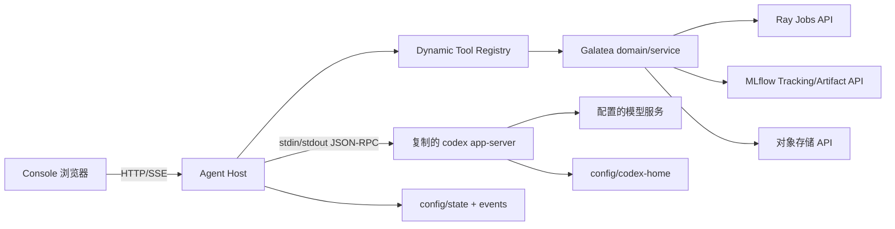

# 01 架构

## 1. 运行单元

首版是一个宿主进程和一个 Codex app-server 子进程：

| 单元 | 职责 | 状态所有权 |
| --- | --- | --- |
| `codex-agent` Host | HTTP/SSE、会话串行化、JSON-RPC 路由、Dynamic Tool Registry、脱敏、事件落盘 | `state/`、`events/`、进程锁 |
| `codex app-server` | 原生模型调用、Thread/Turn、Skill、sandbox、审批、agent loop | `CODEX_HOME` 下的 Codex 状态 |
| Galatea domain/backend | 17 个支持工具的原有业务约束、Ray Job、MLflow、Artifact 证据 | 现有 platform service 与 `state_root` |
| Reconciler | 周期调用 `Service.reconcile_all`，恢复 pending/unknown 提交并处理超时停止 | 与 Registry 共用 `Service`、进程锁和 operation 状态 |
| Console 浏览器 | 发送用户输入、查看流式事件和工具回执 | 不持久化权威状态 |

宿主是唯一能同时看见 app-server RPC 和 Galatea backend 的边界。浏览器从宿主获得投影，
不能向 app-server 或后端建立第二条控制通道。

## 2. 进程关系

不保留 `galatea-mcp --transport ...` 进程。MCP 包中的 `server.py`、MCP session manager、
bearer token 和 `/mcp` 路由不进入新应用。

## 3. 会话与并发

- 一个 Agent 实例默认只启动一个 app-server 子进程。
- 每个 Console session 映射一个 Codex `threadId`；一个 session 内的 turn 串行。
- 不同 session 的并行上限由 Host 的 `max_active_turns` 控制；超限返回可重试的 `busy`，不
  把消息丢给 app-server。
- 一个 dynamic tool call 在 app-server 发出后由 Host 的 Tool Registry 执行；同一
  `callId` 只能产生一次回执。未知重复调用必须返回相同的幂等回执或明确 `unknown`，不能
  再次提交有副作用的 Job。
- Host 停止时先停止接收新请求和新的 reconcile 写入，再 interrupt 活跃 turn，等待 handler/reconcile
  到达终态或 `unknown`，然后等待 app-server 退出，最后释放锁。

## 4. 端到端调用

1. Console `POST /api/sessions` 创建 session，Host 启动或复用 app-server，并调用
   `thread/start`。
2. Host 将 `services/galatea-mcp/contracts/tools.json` 的 schema 与版本化 catalog metadata 合并，
   再按 principal actions 过滤，在 `thread/start` 中传入 `galatea` namespace。Registry 支持全集是
   17 个函数，实际 session catalog 可以是严格子集。
3. Host 保存 `threadId`、runtime digest、tool catalog digest 和 session 配置快照。
4. Console `POST /api/sessions/{id}/messages` 写入带 `clientUserMessageId` 的 turn。
5. Host 转发 `turn/start`，同时旁路记录 app-server 的所有响应和通知。
6. app-server 发送 `item/tool/call` server request；Host 校验 thread/turn/call/tool/schema，先把
   canonical arguments 和业务幂等身份作为 intent 原子落盘，再执行内化工具。
7. Host 获取明确结果后先原子保存 receipt；若在副作用开始后、receipt 保存前崩溃，则该 call 进入
   `unknown` 并依靠业务幂等键和 operation 对账，禁止直接重放。receipt 持久化成功后，Host 才把
   安全 JSON 作为 `inputText` 返回 `success` 和 `contentItems`。
8. app-server 继续原生 agent loop，直到 `turn/completed`；Host 只把最终 Agent message
   和公开事件投影给 Console。
9. Host 原子保存 turn 结果、最后消息 ID、调用回执和 usage；SSE 客户端可从事件序号续读。

Host 取得进程锁后必须运行与现有 MCP server `watchdog` 等价的有界后台 reconcile。它与 Tool
Registry 共享同一个 `Service` 和单写边界；同一 `state_root` 只能有一个写者和一个 reconcile
调度器。启动时至少完成一次有截止时间的成功 reconcile 才能 ready；运行中记录最近成功时间，超过
冻结的 freshness 阈值或循环退出即撤销 readiness。异常只记录脱敏故障并保持状态，下次周期继续
对账。缺少该循环时 pending submission、平台状态刷新和超时停止无法保证推进。

## 5. 依赖决策

首版只使用以下已有或随应用发布的东西：

- 复制的 Codex runtime 与其资源/许可证；
- `services/galatea-mcp` 的 domain、contracts 和后端适配代码，按内部 Python 包方式接入；
- Python 标准库的进程、文件锁和 JSON 基础设施；
- 仓库现有平台客户端依赖（Ray、MLflow、boto3 等），只在相关后端启用。

不新增 PostgreSQL、SQLite、Redis、消息队列、MCP SDK、OpenAI Agents SDK、第三方 Agent
编排框架或独立控制面。当前 HTTP/SSE 使用 uvicorn ASGI 与原生 HTML/JS；版本、许可证、鉴权、
并发、背压和生命周期见 [配置与部署](06-config-deployment.md)。真实平台部署仍须接纳目标环境证据。
