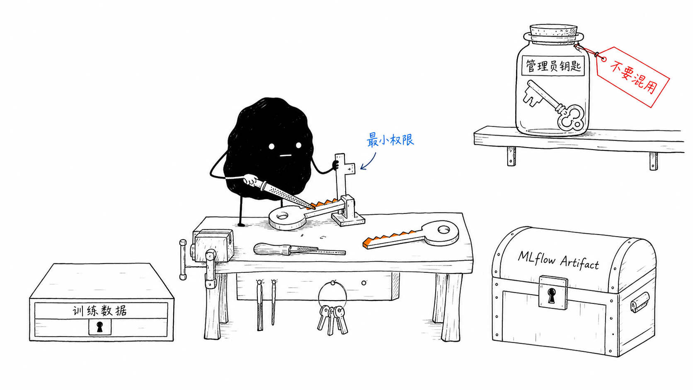
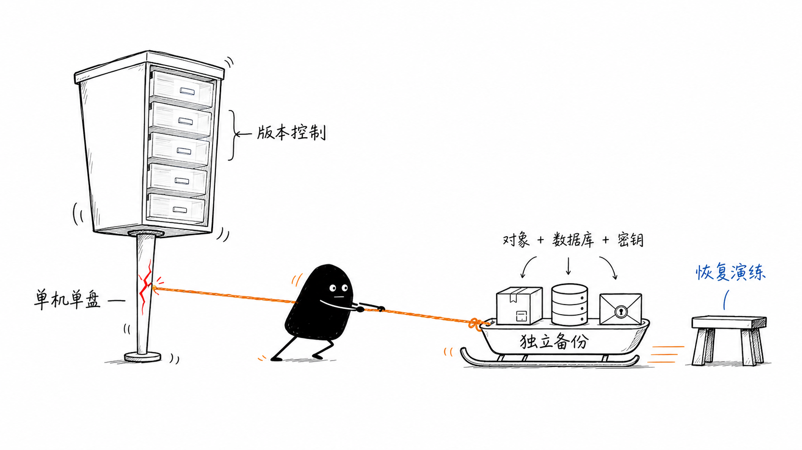

# MinIO 本地安装、启动与运维

本文记录当前训练服务器上的 MinIO 单机部署。MinIO 提供 S3 兼容对象存储，替代原实施手册中的腾讯云 COS，用于保存训练数据、Manifest、预处理结果、Checkpoint 和 MLflow Artifact。

> 当前部署是单机、单盘模式，适合当前一台服务器的训练闭环，不等同于高可用或多副本生产对象存储。数据目录、`mlflow.db` 和密钥都必须纳入独立备份策略。

## 1. 当前部署基线

| 项目 | 当前值 |
|---|---|
| 操作系统 | Ubuntu 22.04 LTS，x86_64 |
| MinIO Server | `RELEASE.2025-09-07T16-13-09Z` |
| MinIO Client | `RELEASE.2025-08-13T08-35-41Z` |
| MinIO API | `http://127.0.0.1:9000` |
| MinIO Console | `http://127.0.0.1:9001` |
| 数据目录 | `/data/ai/chenzhangyue/code/galatea/platform-data/minio/data` |
| Server 二进制 | `/usr/local/bin/minio` |
| Client 二进制 | `/usr/local/bin/mc` |
| 服务账号 | `minio:minio` |
| systemd unit 源文件 | `/data/ai/chenzhangyue/code/galatea/systemd/minio.service` |
| systemd unit 安装位置 | `/etc/systemd/system/minio.service` |
| 环境文件 | `/etc/minio/minio.env`、`/etc/minio/mlflow-s3.env` |
| 训练数据 Bucket | `training-data` |
| MLflow Artifact Bucket | `mlflow-artifacts` |

当前服务只监听回环地址。远程访问 Console 使用 SSH 隧道，不直接开放 9000、9001 到公网。

## 2. 存储规划

```text
platform-data/minio/data/
├── training-data/
│   ├── datasets/raw/<dataset-name>/<source-date>/
│   ├── datasets/processed/<dataset-name>/<dataset-version>/
│   └── datasets/manifests/<dataset-name>/<dataset-version>.csv
└── mlflow-artifacts/
    └── <由 MLflow 管理的实验和 Run 目录>/
```

推荐约束：

- `training-data` 和 `mlflow-artifacts` 都保持私有。
- 两个 Bucket 都启用版本控制，原始数据和 Artifact 不覆盖写入。
- 训练配置中的 URI 使用 `s3://training-data/...`，不要使用 `latest`。
- MLflow 的 Artifact 统一使用 `s3://mlflow-artifacts`，由 MLflow Server 代理客户端上传和下载。
- 该目录位于仓库的 `platform-data/` 下，已被 `.gitignore` 忽略；不要把对象文件提交到 Git。

## 3. 安装 MinIO 二进制

以下示例固定版本，并在安装前校验 SHA256。已有同版本二进制时不要重复下载。

```bash
MINIO_VERSION=RELEASE.2025-09-07T16-13-09Z
MC_VERSION=RELEASE.2025-08-13T08-35-41Z
TMP_DIR=$(mktemp -d /tmp/minio-install.XXXXXX)

curl -fsSL \
  "https://dl.min.io/server/minio/release/linux-amd64/archive/minio.${MINIO_VERSION}" \
  -o "$TMP_DIR/minio"
MINIO_SHA=$(curl -fsSL \
  "https://dl.min.io/server/minio/release/linux-amd64/archive/minio.${MINIO_VERSION}.sha256sum" \
  | awk '{print $1}')
echo "$MINIO_SHA  $TMP_DIR/minio" | sha256sum -c -

curl -fsSL \
  "https://dl.min.io/client/mc/release/linux-amd64/archive/mc.${MC_VERSION}" \
  -o "$TMP_DIR/mc"
MC_SHA=$(curl -fsSL \
  "https://dl.min.io/client/mc/release/linux-amd64/archive/mc.${MC_VERSION}.sha256sum" \
  | awk '{print $1}')
echo "$MC_SHA  $TMP_DIR/mc" | sha256sum -c -

install -o root -g root -m 0755 "$TMP_DIR/minio" /usr/local/bin/minio
install -o root -g root -m 0755 "$TMP_DIR/mc" /usr/local/bin/mc

minio --version
mc --version
```

如果下载源临时超时，使用支持断点续传的下载工具重试；不要跳过校验，也不要使用来源不明的二进制。

## 4. 创建服务账号和目录

```bash
getent group minio >/dev/null || groupadd --system minio
id minio >/dev/null 2>&1 || \
  useradd --system --gid minio --home-dir /var/lib/minio --shell /usr/sbin/nologin minio

install -d -o minio -g minio -m 0750 \
  /data/ai/chenzhangyue/code/galatea/platform-data/minio/data
install -d -o root -g root -m 0750 /etc/minio
```

MinIO 进程不使用 `root` 运行。只有 `minio` 用户需要访问对象数据目录；`/etc/minio` 下的凭据文件只允许 root 读取。

## 5. 配置环境文件

### 5.1 MinIO Server

生成一次管理员密码并保存到 root-only 文件。密码不能写入仓库、Notebook 或聊天记录：

```bash
MINIO_ROOT_PASSWORD=$(openssl rand -base64 36 | tr -dc 'A-Za-z0-9' | head -c 32)
cat > /etc/minio/minio.env <<EOF
MINIO_ROOT_USER=minioadmin
MINIO_ROOT_PASSWORD=$MINIO_ROOT_PASSWORD
MINIO_VOLUMES=/data/ai/chenzhangyue/code/galatea/platform-data/minio/data
MINIO_OPTS="--address 127.0.0.1:9000 --console-address 127.0.0.1:9001"
MINIO_BROWSER_REDIRECT_URL=https://coder.vdian.net/GC5026/proxy/9001/
EOF
chmod 0600 /etc/minio/minio.env
chown root:root /etc/minio/minio.env
```

`minioadmin` 只用于首次初始化和管理员操作，训练脚本和 MLflow 不使用该账号。

### 5.2 MLflow 专用账号

MLflow 通过 Server 端的 S3 凭据访问 MinIO，客户端不需要持有 MinIO 长期密钥：

```bash
MLFLOW_S3_PASSWORD=$(openssl rand -base64 36 | tr -dc 'A-Za-z0-9' | head -c 32)
cat > /etc/minio/mlflow-s3.env <<EOF
AWS_ACCESS_KEY_ID=mlflow
AWS_SECRET_ACCESS_KEY=$MLFLOW_S3_PASSWORD
AWS_DEFAULT_REGION=us-east-1
MLFLOW_S3_ENDPOINT_URL=http://127.0.0.1:9000
EOF
chmod 0600 /etc/minio/mlflow-s3.env
chown root:root /etc/minio/mlflow-s3.env
```

训练数据读写使用另一个 `training-data` 账号；不要复用 `mlflow` 或管理员凭据。

三类身份要像三把齿形不同的钥匙：训练任务只打开 `training-data`，MLflow Server 只打开
`mlflow-artifacts`，管理员钥匙则封存给初始化和运维操作。这样即使某个训练进程的凭据
泄露，影响范围也被限制在它真正需要访问的 Bucket 内。



*账号与 Bucket 一一对应；管理员凭据不进入训练脚本，也不与服务账号混用。*

为训练账号保存只供受控脚本读取的环境文件：

```bash
TRAINING_DATA_PASSWORD=$(openssl rand -base64 36 | tr -dc 'A-Za-z0-9' | head -c 32)
cat > /etc/minio/training-data-s3.env <<EOF
AWS_ACCESS_KEY_ID=training-data
AWS_SECRET_ACCESS_KEY=$TRAINING_DATA_PASSWORD
AWS_DEFAULT_REGION=us-east-1
AWS_ENDPOINT_URL_S3=http://127.0.0.1:9000
EOF
chmod 0600 /etc/minio/training-data-s3.env
chown root:root /etc/minio/training-data-s3.env
```

## 6. 安装并启动 systemd 服务

仓库中的 unit 已固定监听地址、数据目录和安全限制：

```bash
install -o root -g root -m 0644 \
  /data/ai/chenzhangyue/code/galatea/systemd/minio.service \
  /etc/systemd/system/minio.service

systemctl daemon-reload
systemctl enable --now minio.service
systemctl --no-pager --full status minio.service
```

健康检查：

```bash
curl -fsS http://127.0.0.1:9000/minio/health/live
ss -lntp | grep -E ':(9000|9001)\\b'
```

预期监听为 `127.0.0.1:9000` 和 `127.0.0.1:9001`。如果看到 `0.0.0.0:9000` 或 `0.0.0.0:9001`，先停止服务并检查 `/etc/minio/minio.env`，不要直接把端口暴露到公网。

## 7. 创建 Bucket 和最小权限账号

先设置只在当前 shell 中生效的管理员别名：

```bash
MINIO_ROOT_USER=$(sed -n 's/^MINIO_ROOT_USER=//p' /etc/minio/minio.env)
MINIO_ROOT_PASSWORD=$(sed -n 's/^MINIO_ROOT_PASSWORD=//p' /etc/minio/minio.env)
mc alias set local http://127.0.0.1:9000 \
  "$MINIO_ROOT_USER" "$MINIO_ROOT_PASSWORD"
```

创建私有 Bucket 并启用版本控制：

```bash
mc mb --ignore-existing local/training-data
mc mb --ignore-existing local/mlflow-artifacts
mc anonymous set private local/training-data
mc anonymous set private local/mlflow-artifacts
mc version enable local/training-data
mc version enable local/mlflow-artifacts
```

创建 MLflow 账号和策略。该策略只允许访问 `mlflow-artifacts`：

```bash
MLFLOW_S3_PASSWORD=$(sed -n 's/^AWS_SECRET_ACCESS_KEY=//p' /etc/minio/mlflow-s3.env)
mc admin user add local mlflow "$MLFLOW_S3_PASSWORD"
```

保存以下内容为临时文件 `/tmp/mlflow-policy.json`，应用后可删除临时文件：

```json
{
  "Version": "2012-10-17",
  "Statement": [
    {"Effect":"Allow","Action":["s3:ListAllMyBuckets"],"Resource":["arn:aws:s3:::*"]},
    {"Effect":"Allow","Action":["s3:ListBucket","s3:GetBucketLocation"],"Resource":["arn:aws:s3:::mlflow-artifacts"]},
    {"Effect":"Allow","Action":["s3:GetObject","s3:PutObject","s3:DeleteObject"],"Resource":["arn:aws:s3:::mlflow-artifacts/*"]}
  ]
}
```

```bash
mc admin policy create local mlflow-artifacts-policy /tmp/mlflow-policy.json
mc admin policy attach local mlflow-artifacts-policy --user mlflow
```

训练数据账号只访问 `training-data`。将以下内容保存为临时文件 `/tmp/training-data-policy.json`，如果训练任务只读数据，可以把 `s3:PutObject`、`s3:DeleteObject` 从策略中移除：

```json
{
  "Version": "2012-10-17",
  "Statement": [
    {"Effect":"Allow","Action":["s3:ListAllMyBuckets"],"Resource":["arn:aws:s3:::*"]},
    {"Effect":"Allow","Action":["s3:ListBucket","s3:GetBucketLocation"],"Resource":["arn:aws:s3:::training-data"]},
    {"Effect":"Allow","Action":["s3:GetObject","s3:PutObject","s3:DeleteObject"],"Resource":["arn:aws:s3:::training-data/*"]}
  ]
}
```

创建完成后，将策略绑定到 `training-data` 用户。密码从 root-only 环境文件读取，因此这段命令可以在新的 shell 中执行：

```bash
TRAINING_DATA_PASSWORD=$(sed -n 's/^AWS_SECRET_ACCESS_KEY=//p' /etc/minio/training-data-s3.env)
mc admin user add local training-data "$TRAINING_DATA_PASSWORD"
mc admin policy create local training-data-policy /tmp/training-data-policy.json
mc admin policy attach local training-data-policy --user training-data
```

## 8. MLflow 接入 MinIO

`systemd/mlflow.service` 已配置：

```text
EnvironmentFile=/etc/minio/mlflow-s3.env
--serve-artifacts
--artifacts-destination s3://mlflow-artifacts
After=network-online.target minio.service
```

安装或修改 unit 后执行：

```bash
install -o root -g root -m 0644 \
  /data/ai/chenzhangyue/code/galatea/systemd/mlflow.service \
  /etc/systemd/system/mlflow.service
systemctl daemon-reload
systemctl restart mlflow.service
curl -fsS -H 'Host: localhost' http://127.0.0.1:5000/health
```

训练脚本只需要指向 MLflow：

```bash
export MLFLOW_TRACKING_URI=http://127.0.0.1:5000
```

不要在训练脚本中设置 `MLFLOW_S3_ENDPOINT_URL` 或 MinIO 密钥；`--serve-artifacts` 会让 MLflow Server 代为上传和下载 Artifact。只有直接用 boto3、`mc` 或独立数据处理脚本访问 MinIO 时，才需要注入相应的 S3 凭据。

## 9. 直接访问训练数据

### 9.1 使用 `mc`

```bash
set -a
source /etc/minio/training-data-s3.env
set +a
mc alias set training http://127.0.0.1:9000 \
  "$AWS_ACCESS_KEY_ID" "$AWS_SECRET_ACCESS_KEY"

mc cp ./dataset-v001.csv \
  training/training-data/datasets/manifests/demo/dataset-v001.csv
mc ls --recursive training/training-data/datasets/
```

生产环境不要把密码直接写进 shell 历史；应从 root-only 文件或受控密钥管理系统注入。

### 9.2 使用 boto3

```python
import boto3

s3 = boto3.client(
    "s3",
    endpoint_url="http://127.0.0.1:9000",
    aws_access_key_id="training-data",
    aws_secret_access_key="<training-data 密码>",
    region_name="us-east-1",
)

s3.upload_file(
    "dataset-v001.csv",
    "training-data",
    "datasets/manifests/demo/dataset-v001.csv",
)
```

训练配置中对应 URI：

```yaml
data:
  manifest_uri: s3://training-data/datasets/manifests/demo/dataset-v001.csv
```

## 10. Console 与远程访问

当前 Console 通过 code-server 暴露时，公开地址是 `https://coder.vdian.net/GC5026/proxy/9001/`。
MinIO 必须设置 `MINIO_BROWSER_REDIRECT_URL`，否则返回的 HTML 会使用 `<base href="/">`，
浏览器加载不到代理路径下的 JS、CSS 和 API。修改后执行 `systemctl restart minio.service`。

MinIO Console 使用普通 `proxy`，不要使用 `absproxy`：普通 `proxy` 会把 `/proxy/9001/`
前缀剥掉后再转发给 MinIO；`absproxy` 会把完整路径透传给后端，而 MinIO Console 并不
支持这种挂载方式。

访问 Console 前还必须先完成 code-server 登录：

```text
https://coder.vdian.net/GC5026/login
```

登录 Cookie 应为 `code-server-session`，Path 为 `/GC5026`。如果 Console 首页返回但
`manifest.json`、JS 或 API 返回 `401`，请在浏览器开发者工具 Network 中确认请求是否带有
该 Cookie；只登录 Coder 平台或 MinIO Console 不等于登录 code-server。

本机浏览器也可打开 `http://127.0.0.1:9001`。远程机器通过 SSH 隧道访问：

```bash
ssh -N \
  -L 9001:127.0.0.1:9001 \
  -L 9000:127.0.0.1:9000 \
  用户名@服务器地址
```

然后在本地打开 `http://127.0.0.1:9001`。9000 API 隧道供本地 S3 客户端使用，9001 Console 隧道供浏览器使用。不要把管理员密码放入 URL。

## 11. 日常运维

```bash
# 查看服务、监听和日志
systemctl status minio.service
ss -lntp | grep -E ':(9000|9001)\\b'
journalctl -u minio.service -n 100 --no-pager

# 修改 /etc/minio/*.env 或 unit 后重启
systemctl daemon-reload
systemctl restart minio.service

# 查看 Bucket、版本控制和空间
mc ls local
mc version info local/training-data
mc version info local/mlflow-artifacts
mc admin info local
du -sh /data/ai/chenzhangyue/code/galatea/platform-data/minio/data
```

删除对象时，启用版本控制的 Bucket 会先产生 delete marker；需要清理历史版本时必须明确评估恢复需求，不能把 `mc rm --recursive --force` 当作日常清理命令。

## 12. 备份与恢复

Bucket 版本控制只能保留同一套存储中的历史对象，不能消除单机、单盘这个共同故障域。
下图中的抽屉虽然有多个版本，却仍共用一条已经开裂的支腿；真正的备份需要把对象、
MLflow 数据库和密钥一起搬到独立位置，并通过恢复演练证明它们能重新组成完整系统。



*版本控制解决误覆盖，独立备份解决故障域；两者不能互相替代。*

至少同时备份以下三类内容：

1. `/data/ai/chenzhangyue/code/galatea/platform-data/minio/data/`：对象数据。
2. `/data/ai/chenzhangyue/code/galatea/platform-data/mlflow/mlflow.db`：MLflow 元数据。
3. `/etc/minio/minio.env`、`/etc/minio/mlflow-s3.env`：凭据和 Endpoint 配置，必须加密保存。

备份前暂停写入或使用文件系统快照，避免 SQLite 数据库和 Artifact 处于不一致状态。恢复到新机器后，先恢复 MinIO 数据与密钥，再启动 MinIO，最后启动 MLflow；不要只恢复 `mlflow.db` 而遗漏 Artifact。

## 13. 故障排查

| 现象 | 检查与处理 |
|---|---|
| `minio.service` 启动失败 | `journalctl -u minio.service -n 100`；检查环境文件、数据目录属主和 9000/9001 端口 |
| 健康检查失败 | `curl -v http://127.0.0.1:9000/minio/health/live`；确认服务没有绑定到其他地址 |
| `mc` 返回 `Access Denied` | 检查 alias 使用的账号、Bucket 名和策略绑定：`mc admin user info local <user>` |
| MLflow 有 Run 但 Artifact 上传失败 | 检查 `mlflow-s3.env`、`s3://mlflow-artifacts`、MinIO 服务状态和磁盘空间 |
| 远程 Console 打不开 | 检查 SSH 隧道；Console 地址是本地 `127.0.0.1:9001`，不是服务器公网地址 |
| 磁盘空间不足 | `df -h /data`、`du -sh .../minio/data`；先扩容或迁移，再清理已确认不需要的历史版本 |

## 14. 安全检查清单

- [ ] 9000、9001 只监听 `127.0.0.1` 或受控内网地址。
- [ ] `/etc/minio/*.env` 权限为 `0600`，不进入 Git。
- [ ] MLflow、训练数据和管理员使用不同账号。
- [ ] Bucket 保持 private，训练输入使用不可变版本路径。
- [ ] MinIO 二进制安装前完成 SHA256 校验。
- [ ] 对象数据、MLflow SQLite 和密钥有可恢复的加密备份。
- [ ] 定期执行一次 Artifact 上传、下载和恢复演练。
