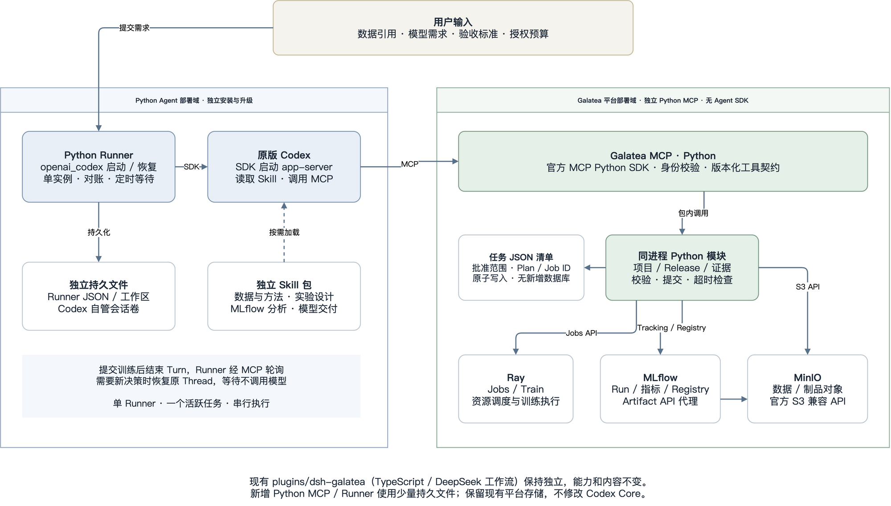

# Galatea × Python Codex 训练 Agent 方案

更新：2026-09-07。状态：独立 MCP、Runner、Skill 和参考 workload 已实现，
本地跨组件验收见验证记录；真实部署、模型调用和训练仍待单独验收。

## 1. 确定的架构边界

**独立 Galatea MCP + 原版 Codex + 独立 Skill 包 + Python Runner。平台与 Agent 解耦，
无需修改 Codex Core，也不改造现有 `plugins/`。**

`plugins/dsh-galatea/` 的 TypeScript 文件属于 DeepSeek Harness/Cordis 工作流。
该插件保持现有能力、接口和运行方式。新方案独立实现 Python MCP，通过官方 Ray、MLflow、
S3 API 接入现有平台；不从旧插件抽取模块，不 import 它，不让旧插件转接新服务。
旧方案仍见 [agent-galatea.md](../agent-galatea.md)。

Python Runner 对接已做源码接口核验的官方 `openai_codex` SDK，由 SDK 启动原版 `codex app-server`。
发布 SDK/Runtime 配对仍待真实验收，随包 Runtime 锁保持 pending。
这不是用 OpenAI Agents SDK 重造 Agent，也不是用 Python 模拟 Codex 的工具、权限或会话系统。
接口与源码依据见 [Python Codex 流程](03-codex-runtime-and-skills.md)。

## 2. 组件与调用关系

[可编辑架构图](assets/platform-agent-architecture.drawio)

| 单元 | 职责 | 拥有的状态 |
| --- | --- | --- |
| Galatea MCP（Python） | 项目检查、计划、提交/观察/停止、Run 与 Artifact 证据、服务端约束 | 管理配置、任务清单、提交记录；不保存 Agent 对话 |
| 原版 Codex | 理解需求、读取 Skill、调用 MCP、分析验证结果、生成建议与报告 | Codex 自己管理的 Thread/会话 |
| 独立 Skill 包 | 训练方法、实验设计、MLflow 分析和交付流程 | 版本化 SKILL.md 与自包含参考资料 |
| Python Runner | 启动/恢复一次 Codex Turn，保存关联 ID，等待训练、对账、超时与取消 | 少量 JSON 状态文件与受限事件日志 |
| 现有 Ray / MLflow / MinIO | 计算调度、实验与模型记录、数据和制品存储 | 各服务既有持久化，继续通过 API 使用 |

用户需求 → Runner → Python Codex SDK → 原版 Codex → Galatea MCP → Ray / MLflow / MinIO。
Codex 提交长任务后输出 `wait_external` 并结束 Turn；Runner 用普通 Python 轮询查询状态，
需要新决策时再恢复同一 Thread。等待期间不发起模型推理。

MCP 不依赖 Codex SDK，Runner 不依赖 Galatea 平台源码，Skill 包不依赖本仓库 checkout。
四者可以同机隔离部署，也可以分别部署；独立性通过依赖和生命周期验证。

## 3. 数据库取舍

**首版不新增 PostgreSQL、SQLite、ORM、数据库迁移、消息队列或独立 training-control 服务。**
上一版为 Campaign、DecisionGrant、预算流水和 Runner 租约设计的两套业务库，超出了当前需求。
这些组件不是 Python Codex 接入的前提。

但“无需新增数据库”不等于“无需持久化”：

- Ray 保存 Job 状态，MLflow 保存 Run、指标、模型和 Artifact，MinIO 保存对象。
- MCP 以每任务一个受保护 JSON 清单保存批准范围、稳定提交 ID 和有限操作记录，提交前原子落盘。
- Runner 保存 `thread_id`、工作区、操作引用、决策序号、下一次检查时间和用量快照。
- Codex 会话由原版 Runtime 保存，通过 SDK 恢复，不读取或修改其内部存储。

首版限定单 MCP 写进程、单 Runner、串行受信任务，本地持久卷配进程锁和原子写入。
多实例接管、多租户共享配额或大规模任务检索有明确需求后再评估事务数据库。
MLflow 自身的数据库有实际用途，保持原状；客户端始终不直接读 `mlflow.db`。
详见 [最小持久化](implementation/01-domain-control.md)与 [恢复流程](05-runner-and-recovery.md)。

## 4. 首版交付范围

先接一个契约完整的已注册 workload，使用预建 Release 和批准配置列表，跑通：
需求与预算 → 检查 → Trial → 验证分析 → 有限优化 → 冻结候选 → 干净重训 → 一次最终测试 → 交付。
未达质量门槛可交付有证据的 `best-effort`；没有可用产物则 `blocked`。
生产 Alias 更新独立授权，首版训练 Agent 不提供推广工具。

首个参考接入位于 [`train-model/ray-tabular-regression/`](../../train-model/ray-tabular-regression/README.md)。
它提供固定签名 Ray Driver、训练/评价身份与数据隔离、MLflow Artifact API 完整性验证、可登记 JSON
示例和逐步真实 E2E 手册。当前仅完成代码与无训练测试；登记前仍需管理员替换真实 S3、Release、
MLflow 与集群身份，随后通过 MCP 执行。实现报告见
[`DEVELOPMENT.md`](../../train-model/ray-tabular-regression/DEVELOPMENT.md)。

全新数据上传、自动创建 workload、动态构建 Release 和真实 LoRA 产品化分期扩展。
已有项目缺少数据身份、固定入口或最终评价边界时先修复契约，不能通过本地命令绕过。
本方案不承诺有限搜索找到全局最优，也不把恢复 Codex Thread 等同于恢复训练 Checkpoint。

## 5. 文档导航

| 文档 | 内容 |
| --- | --- |
| [01 现状与选型](01-current-state-and-official-components.md) | 旧 TS 插件归属、Python SDK 源码证据、后端选型 |
| [02 MCP 契约](02-platform-mcp-contract.md) | 首版工具、项目身份、提交幂等和状态 |
| [03 Python Codex 与 Skill](03-codex-runtime-and-skills.md) | SDK 的真实调用、会话、权限和用量语义 |
| [04 训练工作流](04-autonomous-training-workflow.md) | 数据、基线、优化、重训、评价与交付 |
| [05 Runner 与恢复](05-runner-and-recovery.md) | 文件状态、单实例调度、故障对账 |
| [06 部署与路线](06-deployment-and-delivery.md) | 独立环境、实施顺序与回退 |
| [07 架构纠偏与验收](07-feasibility-review.md) | 已修正的问题、源码依据、待验证能力 |
| [08 端到端联调手册](08-e2e-integration-runbook.md) | 独立安装、部署、故障恢复和真实平台验收 |
| [09 本地验证记录](09-local-validation.md) | 实测结果、测试边界和未完成的真实验收 |
| [实施方案索引](implementation/README.md) | 八个按 Python 方案重写的工作包 |
| [需求样例](examples/campaign.example.yaml) | 后续 LoRA 需求草案，不是有效授权 |
| [Codex 配置](examples/codex-config.example.toml) | 首版 MCP 配置草案 |
| [Turn 输出 Schema](examples/agent-turn.schema.json) | 模型建议的结构，不能替代执行事实 |

新实现保持旧插件与 Codex Core 不变；本地验收没有启动真实训练或变更远端服务。
