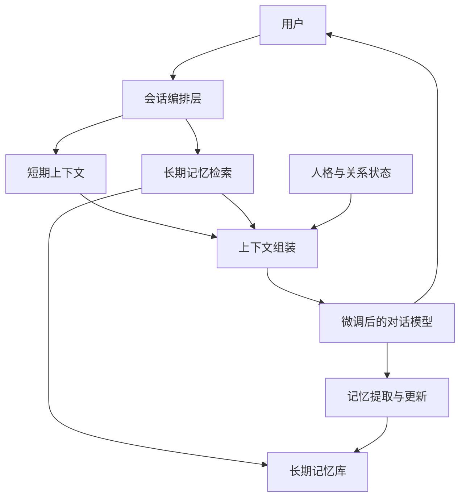
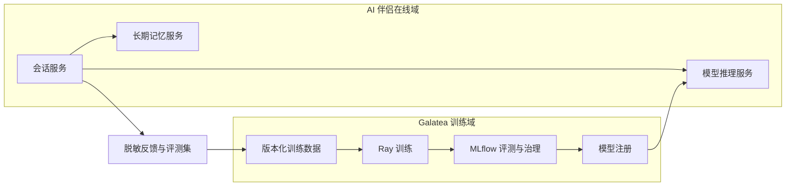

# Galatea 大模型微调与长期记忆技术路线 V1

## 1. 文档目标

本文给出一条基于 Galatea 的大模型微调学习与产品建设路线，最终目标是构建一个具备稳定人格、
自然对话和长期记忆能力的 AI 伴侣。路线面向已有后端与推理工程经验、但尚未系统实践大模型微调的
开发者，强调“小模型快速闭环、能力逐级增加、每阶段均可独立验收”。

首版只确定技术方向、系统边界与项目顺序，不锁定最终模型版本、训练超参数和具体实现代码。

## 2. 核心结论

AI 伴侣需要同时解决两个不同问题：

- **模型能力**：决定角色是谁、如何说话、如何表达情绪、如何使用给定记忆以及如何遵守边界。
- **动态记忆**：保存用户与角色实际发生过的事情，包括偏好、共同事件、承诺、关系变化和时间信息。

长期记忆不能主要依赖持续微调聊天记录。微调更新慢，难以精确修改或删除单条记忆，也容易产生
灾难性遗忘和虚假记忆。因此采用以下混合路线：

> **SFT/LoRA 固化人格和行为，外部记忆系统保存动态经历，DPO 优化主观偏好，评测系统约束幻觉。**

## 3. 方案选择

| 路线 | 优点 | 主要问题 | 结论 |
| --- | --- | --- | --- |
| 持续用聊天记录微调 | 表面上模型与记忆合为一体 | 更新慢、成本高、难删除、易遗忘、不可追溯 | 不采用 |
| 仅依赖 Prompt 与记忆检索 | 上线最快，不需要训练 | 人格和记忆使用行为不够稳定 | 用于早期 MVP |
| 微调与外部记忆结合 | 人格稳定，记忆可更新、可追溯、可删除 | 系统组成更多，需要独立评测 | 推荐主路线 |

## 4. 总体技术架构

整个系统分为六层：

1. **基础模型层**：提供语言、知识、推理和中文对话基础能力。
2. **微调层**：通过 SFT、LoRA 和 DPO 学习人格、对话风格、情绪表达和记忆使用规则。
3. **记忆层**：保存事实、事件、偏好、承诺、关系状态及其时间和来源。
4. **会话编排层**：组合人设、相关记忆、最近对话和当前输入，再调用模型生成回答。
5. **评测层**：分别评估人格一致性、记忆召回、时间冲突、无依据编造和主观对话质量。
6. **训练治理层**：由 Galatea 的 Ray、MLflow 和 MinIO 管理执行、实验、模型和数据资产。

## 5. 训练技术栈

建议以 Hugging Face 生态作为第一阶段的学习主线：

- **PyTorch + Transformers**：模型加载、Tokenization、生成和基础训练能力。
- **Datasets**：训练数据读取、转换、切分和版本标识。
- **TRL SFTTrainer**：监督微调和对话数据训练。
- **PEFT LoRA**：参数高效微调、Adapter 保存与合并。
- **TRL DPOTrainer**：基于成对偏好数据进行对齐。
- **bitsandbytes 或其他量化方案**：只在进入中大模型 QLoRA 阶段后引入。
- **Ray Train / Ray Jobs**：正式任务执行、资源声明和失败记录。
- **MLflow**：记录模型、数据、参数、指标、评测报告和模型晋级。
- **MinIO**：长期保存数据版本、Checkpoint、Adapter、合并模型和报告。

首个项目不使用一键式微调框架屏蔽底层流程。先理解 Chat Template、Label Mask、Loss、梯度、
Checkpoint 和 Adapter，再评估是否引入 LLaMA-Factory、Unsloth 或其他效率工具。

## 6. 模型规模路线

当前单卡约 48 GB 显存，适合采用逐级放大的方式：

| 阶段 | 建议规模 | 训练方式 | 目的 |
| --- | ---: | --- | --- |
| 流程验证 | 0.5B～0.6B | 全参数 SFT 或 BF16 LoRA | 快速看懂和跑通完整链路 |
| LoRA 学习 | 0.6B～1.7B | BF16 LoRA | 掌握 Adapter、显存与效果对比 |
| 人格与记忆训练 | 1.7B～4B | LoRA | 验证数据设计和行为评测 |
| 偏好优化 | 4B 左右 | LoRA + DPO | 调整自然度、边界感与情绪表达 |
| 最终单卡版本 | 8B 左右 | QLoRA 或优化后的 LoRA | 在单卡预算内提升综合质量 |

模型规模不是项目进度指标。只有当小模型的数据、评测和训练链路已经稳定，并确认质量瓶颈来自模型
容量时，才升级到更大模型。

## 7. 递进式项目路线

### 项目 0：预训练模型推理与评测基线

不进行训练，建立固定推理入口和测试问题集，理解 Tokenizer、Chat Template、上下文长度、采样参数
和生成结果之间的关系。输出可重复的基线报告，为后续所有微调实验提供对照组。

**阶段能力**：能够说明同一模型为何因模板或生成参数不同而产生不同结果。

### 项目 1：小模型全参数 SFT

使用约 0.6B 的 Base 模型和极小对话数据完成第一次监督微调。训练目标先选择容易观察的行为，
例如固定输出格式、稳定称呼和基于上下文回答事实，而不是立即追求完整 AI 伴侣体验。

**阶段能力**：理解从对话数据到 Token、Label、Loss、反向传播和 Checkpoint 的完整过程。

### 项目 2：同数据 LoRA 对照实验

保持模型、数据、切分和评测集不变，将项目 1 改为 LoRA，比较可训练参数、显存、训练时间、
Checkpoint 大小和行为效果。同时完成 Adapter 独立加载、继续训练和合并验证。

**阶段能力**：能解释 LoRA 改变了哪些参数，并能判断何时选择全参数训练、LoRA 或 QLoRA。

### 项目 3：AI 伴侣人格 SFT

扩大到约 1.7B 模型，构建覆盖日常交流、关心、冲突、拒绝、安慰、幽默和边界的多轮对话数据。
把人格拆成可观察行为，不依靠一段抽象人设描述判断训练效果。

**阶段能力**：掌握角色数据设计、多轮对话 SFT、过拟合识别和人格一致性评测。

### 项目 4：长期记忆 MVP

暂不新增训练，使用项目 3 的模型接入外部记忆系统。完成对话存储、候选记忆提取、结构化保存、
检索、上下文注入、更新、失效和删除，先验证“过了很久仍然知道我们发生过什么”。

**阶段能力**：能够区分模型参数、短期上下文和长期记忆，并定位错误来自召回还是生成。

### 项目 5：记忆条件 SFT

构造带有“相关记忆、无关记忆、冲突记忆、过期记忆和无记忆”情形的训练数据，让模型学习如何
自然引用可信记忆、如何处理时间变化，以及在缺少依据时承认不知道。

**阶段能力**：让模型不仅能看到记忆，还能可靠地使用记忆，并降低虚假共同经历。

### 项目 6：偏好优化

基于项目 5 收集同一输入下的优选与拒选回答，通过 DPO 优化温柔程度、主动性、情绪回应、记忆引用
方式和边界感。偏好优化不承担事实记忆存储，只调整模型更倾向于哪类行为。

**阶段能力**：掌握偏好数据、SFT 与 DPO 的职责差异，以及自动指标和人工盲测的结合方式。

### 项目 7：扩大模型与产品化

在小模型路线完全通过后，将验证过的数据、训练逻辑和评测迁移到约 8B 模型。引入量化微调、
吞吐优化、模型注册、灰度验证和回滚机制，形成可长期迭代的单卡版本。

**阶段能力**：完成从实验模型到可治理训练资产和可部署服务的闭环。

## 8. 长期记忆技术路线

长期记忆至少分为以下类型：

| 类型 | 内容 | 生命周期 |
| --- | --- | --- |
| 用户画像 | 身份、长期偏好、稳定习惯 | 可更新、可删除 |
| 共同事件 | 一起讨论或经历的具体事情 | 按时间保留 |
| 关系记忆 | 冲突、和解、重要情绪和关系阶段 | 保留来源和后续状态 |
| 承诺与计划 | 约定、提醒、待办和未来安排 | 可完成、取消、过期 |
| 会话摘要 | 一段时期的主题和关系进展 | 分层压缩 |

记忆系统采用“结构化字段 + 语义检索”的组合：

- 结构化字段负责用户、时间、类型、状态、重要性、可信度和来源。
- 语义向量负责找到与当前话题相关的记忆。
- 时间、重要性和关系状态参与重排，不能只按向量相似度取 Top-K。
- 原始消息与提取记忆建立来源关系，支持追溯、纠正和删除。
- 用户明确表达的新事实可以覆盖旧偏好，但旧事件本身不被无痕改写。

记忆写入与记忆读取需要独立评测。写入错误关注遗漏、误提取和重复；读取错误关注漏召回、错召回、
时间冲突和隐私越界；生成错误关注模型忽略记忆或编造记忆。

## 9. 数据路线

训练数据分为三条独立数据线：

1. **SFT 数据**：输入与理想回答，用于学习人设、对话方式和记忆使用规则。
2. **偏好数据**：同一输入下的 chosen/rejected 回答，用于 DPO。
3. **记忆评测数据**：连续多轮事件及后续问题，用于验证写入、召回、时间更新和生成。

数据建设顺序为：少量人工金标准定义行为边界，模型辅助扩写场景，规则与模型联合清洗，人工抽检，
最后形成固定的训练、验证和最终测试集合。真实私人聊天数据默认视为敏感数据，不进入 Git，不出现在
公开日志和示例中，并提供删除与重建机制。

## 10. 评测路线

训练 Loss 只能反映模型对训练目标的拟合程度，不能作为 AI 伴侣质量的最终依据。评测分为四层：

| 评测层 | 核心问题 | 代表指标 |
| --- | --- | --- |
| 训练正确性 | 训练过程是否正常 | Loss、梯度、吞吐、显存、可恢复性 |
| 人格行为 | 是否稳定表现目标人格 | 人格一致率、边界遵守率、回复风格通过率 |
| 长期记忆 | 是否准确记得共同经历 | 召回率、精确率、时间冲突正确率、删除成功率 |
| 主观体验 | 回答是否自然且令人愿意继续交流 | 人工成对胜率、自然度、共情质量、重复率 |

必须长期保留一组模型没有参与训练的场景，覆盖：直接回忆、间接回忆、时间更新、相互矛盾、没有
相关记忆、记忆删除和恶意注入。模型不知道时应明确表达不确定，不能为了维持亲密感虚构共同经历。

## 11. Galatea 接入路线

Galatea 继续负责训练平台能力，不把业务记忆数据库塞进训练平台内部：

- 大模型微调工作负载放入 `train-model/<project-name>/`。
- 每个项目拥有独立环境、配置、源码、入口、测试和说明。
- Ray 负责正式训练任务执行；初期单卡固定为一个 GPU Worker。
- MLflow 记录基础模型、数据摘要、代码版本、训练方式、指标和评测报告。
- MinIO 保存数据 Manifest、Checkpoint、LoRA Adapter、合并模型和报告。
- Model Registry 管理 `candidate`、`champion` 等别名，晋级需要显式评审。
- 长期记忆属于在线应用数据，由独立服务管理，仅把脱敏评测报告写入训练资产。

训练项目与在线系统的边界如下：

## 12. 里程碑与停止条件

| 里程碑 | 包含项目 | 交付结果 | 进入下一阶段的条件 |
| --- | --- | --- | --- |
| M1：微调入门 | 0～2 | 基线、全参数 SFT、LoRA 对照 | 能复现、解释并恢复训练结果 |
| M2：角色可用 | 3 | 稳定人格模型 | 未见场景的人格行为通过门禁 |
| M3：记忆可用 | 4～5 | 可追溯的长期记忆闭环 | 记忆准确且无依据编造受控 |
| M4：体验优化 | 6 | 偏好对齐模型 | 人工盲测优于 SFT 基线 |
| M5：产品化 | 7 | 8B 级候选模型与部署链路 | 质量、成本、延迟和回滚均达标 |

任何阶段出现以下情况都不升级模型规模：数据定义仍频繁变化、评测集不能稳定复现、训练结果无法恢复、
问题来源无法区分、或小模型尚未证明训练信号有效。先修复数据和评测，再增加模型和算力。

## 13. 暂不纳入首版的范围

以下能力放到文本与长期记忆主链路稳定之后：

- 语音识别、语音合成和声音人格。
- 图片理解、角色形象和视频生成。
- 多用户社交、群聊和复杂 Agent 工具调用。
- 多机多卡大规模训练。
- 在线强化学习和自动修改生产人格。

这些能力可以成为后续独立项目，但不应阻塞 M1～M3。

## 14. 推荐执行顺序

首轮严格按照 `项目 0 → 项目 1 → 项目 2` 推进，不并行建设复杂记忆服务。完成 LoRA 对照后，
再开始人格数据设计；人格模型通过后，用不训练的方式实现长期记忆 MVP；只有确认召回链路有效，
才训练模型如何使用记忆。最后再进入 DPO 和 8B 模型。

这条路线的最终形态不是“把所有聊天记进模型参数”，而是形成一个可以持续学习行为、持续积累经历、
准确追溯来源并允许用户纠正和删除记忆的 AI 伴侣系统。

## 15. 参考资料

- [Galatea 仓库说明](../../README.md)
- [Galatea 数据到训练到模型实施手册](../train-guide/data-to-training-to-model-imp-guide.md)
- [Galatea Ray 训练接入规范](../train-guide/ray-training-guide.md)
- [Hugging Face TRL SFTTrainer](https://huggingface.co/docs/trl/sft_trainer)
- [Hugging Face PEFT LoRA](https://huggingface.co/docs/peft/main/conceptual_guides/lora)
- [Hugging Face TRL DPOTrainer](https://huggingface.co/docs/trl/dpo_trainer)
- [Qwen3 技术介绍](https://qwenlm.github.io/blog/qwen3/)
