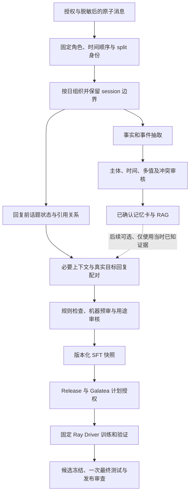

# 按天上下文、话题识别与真实回复训练：完整实施计划

> 版本：`wechat-persona-daily-topic-sft-plan-v1`
>
> 核对日期：2026-09-19
>
> 状态：保留原 58 条机器共识参考与 142 条待裁定分组，已执行同批 200 条的 v4 重审与响应恢复；
> 已完成置信度审计及 v4 新协议检查：GPT/Claude 各 24/24 匹配、非保留参考误保留均为 0/12；
> 最新逐条恢复已补齐 400/400 个判断，导出 99 条机器共识草稿；旧 12 条硬风险继续排除，见第 9.11 节；
> 独立 validation 已完成 400/400 个有效判断、87 条机器共识；双阶段盲参考完成 193/200；
> 原候选回应锚点支持 57%、输入完整性支持 75.5%，未达到 98%/95% 门槛；
> 验收报告已封存，P3 判定返工，7 条待核实已生成盲审页，引用/交错证据仍不足，见第 9.15 节；
> train 返工已修复 99 条草稿中的 55 条原子锚点；同批 200 个目标完成连续上下文重建，
> 隔离 1 条必要前文退化与 12 条旧硬风险后冻结 187 条待复审候选，见第 9.16 节；
> P4–P6 未开始，整个 SFT 交付未完成；
> 事实记忆支线已有批量接受、卡片编译与检索验证，见第 9.2 节。
>
> SFT 新训练集、训练和服务发布仍未完成；记忆支线的独立产物不计作这些阶段的完成证据。
>
> 主导航：[项目实施指南](README.md)

## 1. 要实现的结果

将已授权聊天按自然日组织，在保留说话人、消息顺序和会话边界的基础上，识别话题及回应关系，
把合格的真实回复构造成「回复前的相关上下文 → 目标角色实际回复」，用于后续监督微调（SFT）。
目标是让模型学习如何接话、追问、安慰、解释和结束对话。

一天是数据组织与调度单位，一天内可以有多个话题，一个话题也可以延续到另一会话或次日。
训练样本的单位是一次完整目标回复及其必要上下文；不能把整天内容原样当成每条回复的输入。

本计划同时安排事实记忆分支的衔接：稳定事实和重要事件进入可更新、可撤回的记忆库；回复风格和
互动行为进入 SFT。**事实组的确认、延期或排除，不直接决定同一段聊天能否用于回复训练。**
例如普通晚餐聊天不值得形成持久事实，却可能包含很好的关心与接话样本。

交付分为三个层次：

1. 数据闭环：可追溯的话题、回应关联、候选、机器预审、审核页面和不可变数据快照。
2. 效果验证：在固定验证集上比较现有窗口方案与新方案，确定话题匹配是否实际改善回复质量。
3. 候选交付：通过受控训练、冻结候选、最终测试、质量门禁和明确发布动作，交付模型或原型。

## 2. 当前实际能力与缺口

以下是代码与受控快照的核对结果，不把已有设计文档中的未来能力算作已实现。

| 环节 | 当前能力 | 本计划需补齐 |
| --- | --- | --- |
| 导入与角色 | 已有授权、脱敏、`self/target` 和原始消息 ID | 明确目标角色绑定；保留逐条引用和稳定顺序贯穿后续产物 |
| 会话切分 | 默认无消息间隔超过 120 分钟或会话跨度超过 720 分钟切分；同角色 120 秒内消息可合并 | 保留原子消息，以便识别合并 turn 内的话题变化 |
| 日级上下文 | 已有 day bundle；实际模型主输入按日内 session 和 token 预算切块 | 新建适合 SFT 的、只观察回复前信息的话题上下文构建器 |
| 邻日信息 | 事实抽取可补前后邻日信息以解释日期/指代 | SFT 禁止直接复用双向邻日窗口；只允许同 split 的过去信息 |
| 回复候选 | 每个 target turn 配同会话前最多 8 个 turn，生成 `system/user/assistant` | 话题标注、回应关联、必要上下文选择和完整轮次 token 预算 |
| 引用链 | 标准化消息保留 `reply_to`，当前 session/day 输出未完整传递逐条引用 | 增加有版本的引用映射；缺失时回到标准化消息恢复，不推造 ID |
| 训练编码 | 只监督末尾 assistant；超长样本当前保留 token 后缀 | 新版本在序列化前裁剪完整上下文；Driver 拒绝超长或角色头缺失 |
| 事实审核 | 已有事实组预审、追加事件与审核页 | 与回复训练审核分开；明确机器决定、人工审阅与用途授权 |
| 回复审核资格 | 现有导出的人审检查只要求 reviewer ID/时间非空；内容哈希只绑定串联正文 | 增加服务端审核身份凭据与完整候选语义 digest，不能把现有字段视作强身份保证 |
| 审核并发 | 工作区已补跨进程锁和状态刷新；有重复 revision 的历史收敛记录 | 补期望 revision、幂等键和审计重放恢复，防止旧页面覆盖新决定 |
| 训练后端 | 项目声明 Ray，固定 Driver、Release、MLflow 和 Artifact 契约已存在 | 为新数据版本补绑定、验证套件及同架构对照 |

当前日级事实快照 `daily-memory_20bb25fd1141dbe2cd86` 的聚合统计：

| 项目 | 数量或状态 |
| --- | --- |
| 消息 / 原会话 / 自然日 | 226,628 / 4,397 / 1,735 |
| 抽取块 / 事实候选 / 事实组 | 5,614 / 16,857 / 14,140 |
| 机器审核状态：确认 / 延期 / 排除 / 待审 | 1,660 / 3,157 / 9,323 / 0 |
| 已编译接受记忆卡 / 新 RAG 索引 | 1,660 / BM25 已构建并验证，见第 9.2 节 |
| 人工审核完成 / 正式训练资格 | `false` / `false` |

这些数值是 2026-09-18 的状态快照。`pending=0` 只表示每组已有机器处置，3,157 组延期仍未解决。
1,660 个 `confirmed` 是机器审核状态，不是人工确认卡或 SFT 样本数。
源快照保持 `candidate_review_pending`，最新审核决定保存在独立工作区，这是预期的版本分离。

本轮事实预审使用候选元数据与逐字引文，不等于已经重新阅读每条完整原对话。
对于独立词、第三方归属或跨时间冲突，后续要回看消息上下文，不能仅凭机器置信度放行。

## 3. 总体流程与两条用途分支



第一版只实现直接回复 SFT。记忆增强 SFT 另设配置和消融实验，不能默认把全历史事实库注入样本。
事实分支中的双向观察、日摘要和事后更正不能回流到过去回复的训练输入。

### 3.1 一条样本应如何形成

以下全部是人工编写的示意，不来自真实聊天：

| 顺序 | 角色 | 消息 | 用途 |
| --- | --- | --- | --- |
| 09:00 | self | 今天开会有点紧张。 | 工作话题的起点 |
| 09:01 | target | 是要你做汇报吗？ | 真实回复样本 A 的标签 |
| 09:02 | self | 对，第一次讲这个项目。 | 样本 B 必要上下文 |
| 09:03 | target | 先把开头练两遍，按你准备的顺序讲就好。 | 真实回复样本 B 的标签 |
| 12:00 | self | 中午想吃面。 | 新话题，不进入 A/B 输入 |
| 18:00 | self | 汇报很顺利。 | 后续结果，不进入 A/B 输入 |

样本 A 只用 09:00 及必要的更早信息。样本 B 可以包含 09:00、09:01、09:02。
即使离线处理器持有整天数据，也不能把「汇报很顺利」用于早上的主题概括、情绪判断或模型输入。

## 4. 消息、话题与回应关系的设计

### 4.1 保留消息级证据

日级容器保留 timezone、owner、session、speaker role、message ID、timestamp、原始顺序号、
`reply_to`、消息类型和脱敏文本。若同一时间戳有多条消息，以来源顺序号决定先后；时间或顺序
无法确定的记录进入待核验，不以文件偶然读取顺序代替。

现有 bundle 可复用为读取基础，但它缺失的引用信息必须从授权的标准化消息和血缘映射恢复。
新字段采用新的 schema/session 版本，不能改变旧快照字节或重新解释旧 digest。
说话人不明、媒体内容缺失和引用失效都必须保留显式状态。

### 4.2 话题分类与话题实例

- `topic_category` 使用有限枚举，例如工作、学习、饮食、健康、日常安排、情绪支持、关系沟通和其他。
- `topic_id` 表示一次具体交流线程，用消息来源和算法版本生成稳定 ID；同属「工作」不代表同一线程。
- 一天允许多个 topic；插话后恢复原 topic 使用续接关系，不把中间插话硬拼进去。
- 一条消息允许关联多个 topic；v1 中多话题目标回复必须有足够前文支持，否则延期。
- 超过分类边界或不确定时使用 `other/unresolved`，不让模型任意生成大量新字段。

话题状态按时间前向更新。每次分类只能看到当前消息及之前的消息，已生成的早期样本不能被当天
后续消息反向改写主题标签。批量调用可以提升效率，但不能让一个模型调用看到未来消息后声称
输出了严格前向标签；需要独立前缀输入或可验证的前向状态机。

### 4.3 真实回复与回应关联

1. 原始 `reply_to` 存在时优先用作关联证据，校验同主体范围、同 split、引用消息确实更早。
   前文已有引用可参与前缀选择；目标回复自身携带的引用属于事后标注，不是生成前已知信息。
2. 没有引用时，用回复前的话题状态、相邻轮次和未回应的问题构造关联候选。
3. 离线对齐器可看到待配对的真实回复来判断它回应哪句话，但只能返回更早消息 ID 和原因码，
   不能生成输入正文、补写问题、摘要答案或注入未来信息；相关选择版本作为实验变量记录。
4. 为减少依赖答案挑选上下文带来的偏差，v1 优先采用引用和前缀状态确定输入；需要利用目标回复
   消歧的候选单独标记并隔离。主训练集的上下文选择器不得接收目标正文或未来数据；目标上的
   `reply_to` 只用作离线关联核验，不能自动作为线上可见特征。只有能由回复前信息独立重建上下文的
   候选才进入主训练集；无法复现的保留为诊断材料。
5. 连续同角色消息仅在同一回复范围和话题一致时合并；以首条目标消息为上下文截止点。
   不合并跨中断、跨其他说话人、跨话题或跨 split 的内容。
6. 历史聊天以真实记录为标签；模型只标注关联和质量，不生成一个「更好回复」替换真实目标。

短回复不能只按长度删除。「嗯」可能证据不足，「到了给我说一声」则可能是完整有效回应。
判断单位是上下文中的沟通行为。确需改写、补充媒体说明或合成样本时，另建来源类型和数据版本。

### 4.4 上下文选择与 token 预算

每条样本按以下顺序取上下文：被引用的问题 → 必要指代先行词 → 同话题前序轮次 → 最近必要轮次。
最终仍按原消息顺序呈现，不能把非连续对话拼成看似连续的问答。
跨 session 或前一日续接默认关闭，v1 同 session 通过验收后，才为有明确链接的同 split 续接启用。

使用固定版本的 tokenizer 和 chat template，并在配置中设定固定 `target_token_reserve`。
上下文预算为「序列上限 − 固定回复预留 − system 与模板开销」，选择器只读前缀和该预算，
不能根据真实答案长短倒推保留多少前文。优先移除低相关的完整旧轮次，保留完整问题和角色边界。
选定输入后，再验证真实回复完整落在预留内，且整条序列不超限；否则隔离该样本，或进入后续独立
长度版本。训练、验证和线上选上下文使用相同预留策略，禁止取任意 token 后缀后继续训练。
抽取模型 8,000/32,000 的输入预算不等于训练模型的上下文预算；现有 1,024 长度配置需要实测分布。

每条样本必须满足：

```text
context_message_ids ∩ target_message_ids = ∅
max(context_order) < min(target_order)
all(source_split == sample_split)
all(context_owner == target_owner)
serialized_tokens <= configured_max_length
supervised_tokens == terminal_assistant_target_tokens
```

顺序约束比单独比较时间戳更严格。下游 tokenizer 再次校验，不允许上游通过、训练时静默裁剪。
同时验证 prompt token 序列确实是完整模板输入的前缀，记录目标起止位置、有效监督 token 数及
EOS 策略；模板变化或 padding 不能导致历史 assistant 被监督、真实目标漏标。

## 5. Split 与历史数据复用

### 5.1 从冻结身份开始处理

先加载现有 source/split manifest，再进入按日组织和外部模型调用。训练和开发阶段只处理允许的
train/validation 分区；test 正文、回复和派生摘要不进入话题提示词、机器预审或人工开发页面。
同一天落在不同 split 的 session 必须在调用前分开，不能先聚成一整天让模型读取后再拆分输出。
日级处理键固定为 `(owner, split, local_day)`；跨午夜 session 的每个日切片继承父 session 的 split。

默认保留既有 session 的 split 归属，不因过滤或样本减少重新计算 80/10/10。
涉及同一原始消息、同一目标回复、显式引用或近重复窗口的样本归为泄漏检查组；跨既有 split 的
关联样本隔离，不能把 test 内容移动进 train。不能仅因广义主题相同就把数年聊天连成一个巨型组。

采样配额、重复阈值、分类策略等用 train 开发并固定；validation 用于选择方案和质量评估，
不能通过验证集答案反向生成训练提示词。全量报告分别列出各 split 和隔离数量。

### 5.2 现有日级记忆快照的污染核查

当前日级事实抽取面向历史记忆，不应直接宣称它的输入从未包含旧训练项目的 test session。
第一阶段用源 ID、split manifest 和调用记录核验历史处理范围，尽量只比较身份/哈希，避免再次打开
test 正文。已经进入模型提示词、人工开发视野、事实选择或策略调整的旧 test，不能继续标记为
`untouched`。

若发现污染，保留旧记录并标记证据限制。最终泛化结论使用明确划出的、未暴露的新时间段或独立
保留集，建立新 dataset/protocol；不得静默换测试集后与旧结果合并宣称提升。该工作依赖数据拥有者
提供合格保留集，不能靠修改状态字段解决。

### 5.3 事实记忆用于训练的额外限制

后续若启用 memory-grounded SFT，记忆必须同时满足来源在截止时间之前、同 owner、同 split、
已获相应用途授权和可追溯。用 `source_observed_at/available_at` 检查可用性；不能仅凭
`event_date` 早就使用一条多年后才说出的回忆。禁止从全历史事实账本反推早期回答。

### 5.4 封存 test 与正式编译的衔接

P4 的实验数据快照只生成可处理的 train/validation，test 只绑定已有封存 manifest 的身份、数量和
digest，不为凑齐三个文件而读取正文。当前 compiler/readiness 存在三份 split 非空等检查，新链路
必须先版本化契约：区分可训练分区和封存评估分区，验证后者的真实存在及绑定，不填假文件、
伪造计数或直接关闭检查。该契约纳入 P0 设计和 W7a 实现，未通过时停在候选草案。

最终候选和转换协议冻结、原子 test-once 申请成功后，由隔离评估路径首次读取合格 test 正文，
按冻结的纯前缀规则生成评估视图。不得使用参考答案选择上下文、机器挑选容易回答的子集，或在
测试后调整筛选规则；无法构造的样本计入覆盖率及失败报告，保留完整分母。正式用途审核与封存
评估权限的衔接也需在 P0 明确，不能假定延期生成 test 就免除了现有证据要求。
旧 test 已暴露时，改为绑定第 5.2 节的新保留集，并单独记录不可比较的历史结果。

## 6. 新增数据契约与兼容策略

以下均为待实现版本，首个契约 PR 固定字段与 JSON Schema。真实值保存在受控目录，源码测试仅用
合成数据。各中间层保存所有丢弃和延期原因，禁止只发布最终保留集而无法解释样本流失。

| 产物 | 核心字段 | 校验重点 |
| --- | --- | --- |
| `daily-topic-bundle-v1` | owner、day、sessions、原子消息、role、order、reply_to、split、source digest | 引用完整、角色唯一、排序稳定、split 隔离 |
| `topic-segment-v1` | topic ID/category、message refs、前向状态 digest、观察截止点、续接关系、标注器版本 | 前向观察、成员可回溯、分类受控 |
| `reply-link-v1` | target refs、responds-to refs、关联依据、置信度、是否使用目标消歧 | 关联只指向过去；一条回复的一致所有权 |
| `topic-reply-candidate-v1` | sample ID、source refs、topic、context/target IDs、cutoff、messages、token 统计、风险 | 输入输出不重叠、上下文完整、原文目标一致 |
| `review-decision-v3` | candidate digest、decision、reason、review kind、actor、revision、expected revision、idempotency key | 机器身份不可冒充人工；冲突拒绝；追加审计 |
| `topic-sft-snapshot-v1` | train/validation 产物及封存 test 引用、三个 split 的身份/数量/哈希、selection/review/consent/policy digest | 不可变发布、用途资格、封存权限、审核覆盖和撤回 |

内容 ID 绑定源快照、目标消息 ID、上下文 ID、前处理版本与内容 digest。策略变化产生新候选版本；
网络重试复用同一请求 ID，不能生成一个新的样本或重复审计事件。审计只保存 ID、哈希、枚举理由和
执行元数据；私人原文、完整提示词和模型自由文本理由不进入公共日志。

新候选 digest 对有序 `role/content`、owner/split、context/target 来源引用、截止点及策略版本做
规范化序列化后计算，不能继续只拼接正文。编辑脱敏后的候选另存新 digest，并保留原候选的关联；
审核事件与用途授权均绑定具体 digest，角色、来源或顺序变化必须重新核验。

第一版继续使用当前三段训练格式 `system/user(序列化历史)/assistant(真实回复)`，避免同时改变
上下文选择和训练格式。新 sidecar/metadata 提供主题与血缘，但不能擅自添加到当前
`additionalProperties: false` 的 candidate v2。新增版本化 adapter、Schema 校验和 compiler 分支，
在正式 snapshot 中明确转换版本，保留旧数据读取路径。

将来采用原生多轮 messages 时再做独立版本，并验证历史 assistant 的标签仍为 `-100`，只监督
末尾目标。所有对照使用相同数据加载、模板、训练、checkpoint、评估和 Artifact 代码路径。

## 7. 机器预审、人工审阅与页面交互

回复审核使用 `keep/redact_keep/reject/uncertain`，事实审核继续使用
`confirmed/deferred/rejected`，两者不能仅靠同名状态或 reviewer 文本互转。

### 7.1 处理顺序

1. 确定性硬检查：授权、角色、血缘、split、未来信息、隐私、引用存在、重复和序列长度。
2. 机器质量预审：是否接上话题、是否自洽、是否依赖缺失媒体、回复行为是否值得学习。
3. 分层抽样核验：按话题、角色关系、长度、难例、跨会话关联和机器置信度验证预审质量。
4. 生成具体审核包：候选清单、摘要计数、选择规则、风险项和绑定 digest，支持按批确认合格子集。
5. compiler 只消费具有对应资格的事件；未选项保留未选记录，延期项不冒充审核通过。

机器初筛承担大多数机械工作，不要求用户对全部历史聊天逐条点击。人工可以审阅绑定具体候选列表
和证据的子集或批次；抽样合格只证明该抽样的质量，不能自动把全部候选标成人工已看过。

`review_kind=machine|human` 和授权依据必须由服务端校验并随事件持久化。
把 `reviewer_id` 从 GPT 改成 `owner` 不能授予训练资格。机器预审候选若走实验训练，需要单独绑定
真实的实验授权，保持 `human_review_completed=false`、`formal_training_eligible=false`、
`promotable=false` 和 test 未访问；仍走同一固定 Ray Driver。

现有训练准入只识别特定的 `gpt-prelabel-v1` 实验路径，且要求既有父级人工审核等证据。
新话题预审方法必须显式增加版本、父数据资格、授权和 Driver 校验；不得改名冒充旧方法，
也不能从本计划推断现有父级证据要求已被取消。

### 7.2 新审核页的最小信息

左侧按日期、话题、回应类型和审核状态筛选；中间展示原顺序的必要上下文，标出引用对象；右侧
突出目标回复、模型实际会看到的输入、保留/排除原因与审核身份。默认只展示 train/validation。

必须让审核者看懂「这句话在回应什么」「是否混入另一话题」「裁剪后还能否理解」「目标是原话还是
经人工脱敏修改」。不要让用户只看字段名和孤立名词做二选一。显示模型推断与来源引用的区别。
页面分别统计处理覆盖率、机器保留、证据不足、人工审核完成和可训练数量；待处理为零不表示全部通过。

写入采用跨进程锁、期望 revision 和幂等键；保存前重新校验候选 digest。以追加审计作为恢复依据，
处理“审计已落盘、状态文件尚未替换”的崩溃点。陈旧页面返回冲突并要求刷新，不自动覆盖新决定。
历史重复 revision 保留，只追加更高 revision 或明确冲突处置，不重写审计历史。

## 8. 实施文件与工作包

全部实现归属 `train-model/wechat-persona/`，测试放项目 `tests/`。表内「新增」路径是规划，不是
已存在的入口；脚本只封装参数与调度，可复用逻辑放 `src/wechat_persona/`。

| 编号 | 位置 | 变更与交付物 |
| --- | --- | --- |
| W1 | 现有 `normalize.py`、`sessionize.py`、`daily_memory.py` 及对应 Schema | 逐消息顺序、引用、split 的版本化传递；保留旧版本读取 |
| W2 | 新增 `src/wechat_persona/topic_context.py`、`reply_links.py` | 前向话题状态、引用匹配、受控类别、同话题续接 |
| W3 | 新增 `src/wechat_persona/topic_candidates.py`；扩展 `datasets.py` | 候选构造、完整轮次裁剪、唯一目标与 v2/v3 adapter |
| W4 | 新增 `configs/daily-topic-sft-v1.yaml` 与 topic/reply/candidate Schema | 预算、模型版本、前向限制、输出契约及 `--check/--plan` |
| W5 | 新增 `scripts/preprocess_daily_topics.py`、`build_topic_reply_candidates.py`、`prelabel_topic_replies.py` | 可恢复执行、结构化模型输出、真实回复匹配、哈希审计 |
| W6 | 现有 `review.py`、`review_server.py`、`docs/review.html`、compiler | 话题审核展示、机器/人工事件类型、并发与恢复测试 |
| W7a | 现有 `build_dataset.py`、`datasets.py`、`training.py` 和 Schema | P4 发布前完成新快照读取/准入、封存 test 契约、审核身份与 token 边界拒绝 |
| W7b | 现有 `training.py`、固定 Driver 和新角色配置 | P5 完成 Release/执行绑定、新预审方法准入与同架构评估集成 |
| W8 | 项目 `tests/`，新增话题、因果、引用、快照和恢复测试 | 合成对抗 fixture、属性测试、端到端数据验收报告 |
| W9 | 新增 `src/wechat_persona/fact_resolution.py` 等记忆编译模块 | 主体、时效、多值、否定与冲突契约；衔接记忆卡和现有索引器 |

第一版参数建议在只读计划中校准，而非直接执行全量：

| 参数 | 起始方案 | 调整依据 |
| --- | --- | --- |
| 目标角色 / 时区 | 显式绑定 `target` / `Asia/Shanghai` | speaker map 与 source manifest |
| 跨会话 / 前日上下文 | 默认关闭；后续只允许有证据的过去续接 | 引用恢复与 split 验收 |
| 抽取 tokenizer/model | 显式配置并固定可获取的 revision | API 能力、私有端点配置、校准结果 |
| 日级抽取预算 | 参考现有目标 8,000、硬上限 32,000 token；前缀调用另行估算 | 实际请求体含 Schema/提示词的计数 |
| 训练长度 | 先评估现有 1,024；若必要上下文无法容纳，再单独验证 2,048 | 完整覆盖率、显存和吞吐，不盲目截断 |
| 机器复核并发 / 批量 | 从 4 并发、每批 6 个独立候选校准 | 502/429、延迟、token 和预算上限 |
| 随机种子 / 自动搜索 | 42 / 默认关闭 | 记录采样、shuffle 与无法确定性的外部调用 |

处理 provider/base URL/凭据通过受控环境配置，源码不加入新的私有地址或密钥。
若 provider 不返回不可变模型 revision，记录 requested/returned model、时间、响应 digest 和该限制，
不把温度为零宣称为严格可重复。

## 9. 阶段安排、依赖与负责人

以下以 1 名主要实现者、可安排的数据拥有者/审核者和平台运维为假设；D1 为正式开始实施的第一个
工作日。工期是工程估算，不含授权等待、外部接口中断、GPU 队列和新测试集收集时间。
不以预计日期替代阶段验收。

| 阶段 | 预计安排 | 负责人 | 前置依赖 | 可交付结果与退出条件 |
| --- | --- | --- | --- | --- |
| P0 现状冻结与契约 | D1–D2 | 实现者 + 数据拥有者 | 无 | 现有产物清单、split/暴露审计、用途矩阵、版本与指标草案；明确可处理输入 |
| P1 原子消息与前向话题 | D3–D5 | 数据实现者 | P0 | W1/W2/W4；合成 fixture 全通过；只读计划完整列出覆盖范围与预算 |
| P2 回应配对与候选 | D6–D8 | 数据实现者 | P1 | W3/W5；样本可回到原消息，未来信息/跨 split/标签错配为 0 |
| P3 审核与试点 | D9–D11 | 实现者 + 审核者 | P2 | W6；分层核验报告、可查看审核包、并发及恢复通过；确定继续或返工 |
| P4 全量预处理与快照 | D12–D14 | 数据实现者 | P3 质量门通过 | W7a；全量计数闭合、撤回验证、资格绑定和不可变快照 |
| P5 受控 smoke 与数据对照 | D15–D18，另计排队 | 训练实现者 + 平台运维 | P4、Release、预算和相应授权 | W7b/W8；同架构训练与验证报告；决定是否采纳话题方案 |
| P6 候选交付 | D19–D20，另计盲测与审批 | 实现者 + 审核者 + 发布负责人 | P5 有兼容有效增益 | 清洁重训、候选冻结、test-once、Artifact 验证与明确发布判定 |
| M 事实记忆支线 | P0 后可并行，约 3–5 工作日 | 记忆实现者 + 审核者 | 主体/时间/多值契约明确 | W9；独立卡片/RAG 验收；不阻塞直接回复 SFT |

单人实施时，M 支线后置，主线约 20 个工程工作日。多人可以并行做 P1 契约测试、P3 页面框架和
M 支线，但 P2 不能跳过前向契约，P5 不能在数据验收完成前开始。

每个阶段使用独立 PR/变更包：问题与行为、受影响文件、合成测试、私有报告 digest、当前状态和
下一阶段依赖。后续训练失败不回写前处理快照；需要修改时生成新版本。

### 9.1 优先实施的第一批任务

- [x] P0-01：本轮 source/config/tokenizer/实现文件摘要已绑定试点 manifest；既有工作区变更保留。
- [x] P0-02：已核对 processing、persona_style、evaluation 及本轮机器预审授权；记录见首轮试点报告。
- [x] P0-03：旧 test 的 441 个会话已进入日级记忆处理；最终评测需新的未暴露保留集。
- [ ] P1-01：定义 topic/reply/candidate Schema，增加逐消息 `reply_to` 和顺序字段。
- [ ] P1-02：编写混合话题、延迟回答、同时间戳、跨午夜、缺失引用和未来摘要的合成 fixture。
- [x] P1-03：规则版前缀上下文选择器与纯函数校验已实现；外部模型只核验候选质量，不改写选择输入。
- [x] P2-01：200 条真实回复候选、只读预算计划和机器预审已完成；数据质量尚未达标。

### 9.2 实际执行记录：机器确认事实批量接受（2026-09-18）

用户明确要求把机器确认组作为已确认输入先跑通流程。已完成 M 支线的一条可运行路径：
从当前 1,660 个机器确认组生成 1,660 张 confirmed 记忆卡、独立 BM25 索引及绑定具体选择
digest 的批量接受凭据。32 条自查询、提示词构造、owner 隔离、无匹配查询、全量卡片回读和
临时副本删除验证通过。详细产物、digest、范围与命令见
[机器确认事实的批量接受与记忆链路](accepted-fact-memory.md)。

新增 `fact_resolution.py`、`compile_confirmed_facts.py` 和合成契约测试。该编译路径保留机器
审核来源及原事实键，尚未完成 W9 的主体、多值和时效语义增强。原源快照、审核工作区保持原样；
第 2 节的“未编译卡片/未构建索引”是本次执行前的状态，新结果保存在独立 accepted-fact-memory
快照。P0–P6 的 SFT 验收状态没有因此推进，也未进行模型训练、最终测试或在线服务切换。

### 9.3 实际执行记录：200 条真实回复试点（2026-09-18）

已实现前向规则话题、原子消息引用适配、上下文选择、真实回复候选、版本化 Schema、受控私有
产物和只读审核页。50 个 train 自然日、5,858 条消息生成首批 200 条候选，全部通过结构检查；
真实 tokenizer 和 Driver 编码回读确认 200 条仅监督目标、无静默截断。

机器预审建议保留 146、排除 25、待定 29。回应关联估计 170/200，上下文完整估计 178/200，
均未达到计划建议门槛，且引用/交错话题难例证据不足。P3 处于返工状态；P4–P6 未开始。
P1/P2 已具备首轮可运行实现，但独立中间层 Schema、模型语义标注、完整属性测试和正式训练准入
仍待完善，不能把首轮链路接通写成全阶段验收通过。全部产物、摘要与下一步见
[真实回复 SFT 首轮试点记录](daily-topic-sft-pilot.md)。

### 9.4 实际执行记录：上下文修正与第二轮复审（2026-09-18）

新增 `prefix-topic-exchanges-v2`：历史问答成组选择、前缀引用递归补齐、剩余预算补充更早
前文。固定首轮 200 个真实目标重建，没有替换目标或新增结构隔离；151 条输入改变，49 条不变。
实际 tokenizer 与 Driver 编码检查通过，v1 原 200 条仍能逐字段完全重建。

第二轮机器建议保留 152、排除 18、待定 30；关联正确 176/200（88%），上下文完整
179/200（89.5%）。输入未变的样本也有审核翻转，不能把全部改善归因于选择器。关联或上下文
任一项失败的 30 条中，11 条已经用尽当前 session/day 的前文，19 条还有更早前文可核对。
引用为 0 条、规则话题回转 4 条，关键难例证据仍不足。

建议保留草案、全量审核页、固定目标对照和持久化 API 预算账本已归档，详见
[真实回复 SFT 第二轮记录](daily-topic-sft-v2.md)。P3 继续处理前缀语义关联、缺失证据延期及
独立核验；P4–P6 尚未开始，未启动训练。

### 9.5 实际执行记录：证据盲审与 v3 结构修复（2026-09-18）

对 v2 的全部 200 条隐藏旧结论进行新协议机器核验，并为原先的 30 条问题样本补充完整过去
消息做离线诊断。原 keep 152 条中，117 条再次获支持、35 条有分歧；原 reject/uncertain 中
分别有 5/9 条获得新协议支持。该结果是同一服务的机器复核支持率，不是独立真值或人工 precision。
已将 117 条共同 keep 导出为独立草案，输入和真实目标不变，回应对象以原消息 ID 单独绑定。

30 条问题中，仅 2 条有新增必要前文的证据；19 条用全部前文仍不足以确认关联或完整理解，
另 9 条属于审核分歧。其中一条遗漏定位为 v2 错误排除历史 target 开场消息，已增加 v3：
仅在源消息证明前缀包含 session/day 起点时允许保留，截断历史仍保持原限制。
同一批 200 个目标重建完成，18 条输入改变，已恢复这一遗漏；v3 尚未复审，不继承旧质量标签。

API 40 次请求完成 230 个视图，处于冻结预算内；完整候选、诊断、配对证据、审核页面及摘要见
[证据盲审与第三版上下文修正](daily-topic-sft-evidence-audit.md)。P3 继续校准分歧和独立核验，
P4–P6 尚未开始。原 200 条总体比例、原 keep 复核支持率与共识子集覆盖率分别报告，不能互相代替。

### 9.6 实际执行记录：跨模型家族核验与 58 条草案（2026-09-18）

完成 Claude 对 v3 全部 200 条及改动前 18 条 v2 的独立调用，并由 GPT 重新核验 18 条改变的
v3 输入。原 117 条 GPT 共识中，59 条获 Claude 支持（50.43%）；这只是跨模型机器支持率，
不是人工准确率。原 49 条 keep 分歧全部获得补充判断，模型之间仍有明显口径差异。

按事先固定规则，共同 keep 63 条中排除 4 条回应锚点分歧和 1 条旧硬风险，导出 58 条原样 v3
草案及独立回应证据，机器来源和非正式训练资格保持不变。51 条显式绑定完全相同的旧输入和
原子来源，7 条绑定新审核。18 条改动输入各有 1 条从 uncertain 转 keep、从 keep 转 uncertain；
已修复开场证据的样本仍有跨模型分歧，不能把结构修复直接写成质量改善。

实际调用 50 次（原预算内 44 次、缺失格式批次恢复 6 次），完整回收 236 个审核视图；没有
重问已有有效结论。项目 250 项测试、58 条真实 tokenizer/目标监督检查、完整摘要与权限回读、
完成后零新增请求的重跑均通过。详情和产物见
[跨模型家族核验](daily-topic-sft-cross-review.md)。P3 尚未验收，P4–P6 未开始；下一步先裁定
审核口径、旧风险和回应锚点分歧，再冻结标准并核验独立 validation。

### 9.7 实际执行记录：分歧分流与判据检查（2026-09-18）

完成来源绑定的只读裁定工作台：142 条未纳入草案的样本分为旧风险 12、回应对象分歧 4、
关联判断分歧 67、完整性分歧 13、资格分歧 8、双方均非 keep 38；58 条机器共识保留为参考。
45 条待裁定样本已用尽同 session/day 的前文，97 条仍有未选前文。4 条锚点分歧中 1 条属于
同一真实轮次内的不同消息，3 条跨轮；同轮没有自动视作通过。

新增 18 个合成判据用例，用旧实际审核协议各核验一次：GPT 的状态/关联/完整性与草拟参考
全部一致 16/18，Claude 为 15/18。区别集中在明确无关联的 reject/uncertain、完整性与关联
分轴、有依据的主动提醒。这是合成参考匹配统计，不是私有数据真实 precision。

已实现独立版本的分轴协议核心：模型提供关系、完整性、沟通价值、风险与引用，规则决定
最终状态；保留 0.9 阈值，不回写旧标签或草案。新协议尚未接入实际调用或独立校准。详情、
入口与摘要见[分歧分流与判据检查](daily-topic-sft-adjudication.md)。275 项测试、实际页面筛选、
不可变重跑均通过；本轮额外 6 次请求只使用合成数据。P3 仍未验收，下一步完成新协议的独立
用例验证和真实分歧裁定，再确定 validation 协议；P4–P6 未开始。

### 9.8 实际执行记录：新版审核入口与新用例检查（2026-09-18）

已实现分轴审核的 plan/execute 入口、持久预算、原始响应留存、逐条失败隔离、不可变重放和
真实审核前的校准门禁。固定 24 个新合成用例，各审核器须有效完成 24 条，状态与核心三项
匹配各至少 22/24，负例误保留为 0。实际 8 次请求已结束，检查未通过：

- GPT 有效回收 17/24，状态与核心三项匹配各 16/24，负例误保留 1 条。
  一批请求 `gpt-5.6-sol` 却返回 `gpt-6-sol`，6 条拒收；另 1 条关联枚举和锚点互相矛盾。
- Claude 有效回收 24/24，状态匹配 16/24、核心三项匹配 15/24，负例误保留 0 条。
  分歧涉及短沟通的价值、置信度门及风险与回应关系的独立判断。

没有调低阈值或重写参考答案。即使解决模型身份和格式问题，已有语义结果也不足以通过门槛。
真实 200 条新版审核已被入口实际阻断，原 58 条参考、142 条待裁定及 12 条旧风险保持不变。
服务报告输入 26,167、输出 4,824 tokens，无私有样本调用；重放后仍为 8 次请求。

286 项项目测试、产物摘要和权限检查通过。详情、入口及失败归因见
[新版分轴协议执行与独立用例检查](daily-topic-sft-axes-review.md)。本轮 24 条已转为开发诊断
材料，后续先修复网关身份与协议判据，再用新的冻结用例检查；P3 尚未验收，P4–P6 未开始。

### 9.9 实际执行记录：v3 判据、路由与置信度定位（2026-09-18）

保持 v2 源码和失败结果，新增 v3 判据，明确短确认/感谢的沟通价值、具体外部事件缺失以及
风险和关联独立判断。增加两次返回身份一致的 preflight、后续每次精确匹配和身份漂移中断。
标准 `gpt-5.6` 名称虽在网关目录中，两次探针失败；单次诊断确认 HTTP 502、upstream_error。
使用单独记录的 sol 恢复配置完成 4 次 preflight，再完成 8 次新用例校准。

GPT/Claude 均有效回收 24/24，关联、上下文完整性和允许锚点集合均匹配 24/24，负例误保留
均为 0/9。最终状态匹配分别为 24/24、21/24；Claude 三项语义判断满足条件，但自报置信度
0.88、0.72、0.88 导致延期。0.9 保留门和 22/24 匹配门保持原样，整体检查仍未通过。

本轮 17 次推理请求全部为合成探针/用例，真实审核入口已实际阻断；旧 58/142 分组不变。
298 项测试通过，v2 和 v3 preflight 重放均无新增调用。详情、成本、完整摘要和三个剩余
用例见 [v3 判据澄清与路由核验](daily-topic-sft-axes-v3.md)。下一步单独验证自报置信度门的
使用依据，不能通过临时降低门槛或重问同一批用例过关。P3 未验收，P4–P6 未开始。

### 9.10 实际执行记录：置信度审计与 v4 证据协议（2026-09-18）

分别审计旧 v2/v3，定位仅被低于 0.9 分数拦下的 Claude 响应为 5/3 条，均为参考保留；
v2 GPT 的一个误保留却报 0.99。样本不足以拟合或证明替代阈值，因此保持旧判断和失败门原样。
新增独立 v4 实验协议：置信度如实保留作对照，延期要求分轴状态和原消息不确定性证据一致。
引文、索引或未决轴不匹配直接拒收；双模型共识、共同原子锚点和旧硬风险门继续执行。

新的 24 条用例在调用前冻结，12 保留、6 延期、6 排除；两模型有效回收、状态、核心轴和锚点匹配
均为 24/24，非保留参考误保留均为 0/12，固定 22/24 与零误保留门通过。
这仅证明本组合成协议检查通过，不证明真实数据精度或完成 P3。
同批 200 条已执行 72 次初审/修复，回收 315 个有效判断；随后用独立 16 次预算只恢复失败项，
原 315 个判断逐条不变，新增 67 个，最终 GPT 200/200、Claude 182/200。
剩余 18 个全部是 Claude 空响应；响应包只有角色字段、没有审核正文，不能本地解析补齐。
已有 89 条诊断共识（原 58 中 48 条、原 142 中 41 条），但完整回收门未满足，未导出新草稿。
旧 58 条草稿及 12 条硬风险保持原样；下一步先定位接口空响应，再单独恢复这 18 个判断。

321 项测试通过；真实阶段 88 份原始请求、来源/预算/决定摘要和不可变重放均核对通过。
实际摘要、预算及证据定义见
[v4 显式不确定性证据实验](daily-topic-sft-axes-v4.md)。P4–P6 未开始，未训练或变更模型别名。

### 9.11 实际执行记录：逐条恢复与完整机器草稿（2026-09-18）

在用户继续指令下，新增单独冻结的逐条恢复配置和入口，绑定第 9.10 节已封存的恢复 manifest；
仅请求缺失的 18 个 Claude 判断，继承原 382 个有效结果，不重问有效保留、排除或延期。
网关、精确模型身份、prompt、Schema 和单次输出上限保持不变，只将批大小改为 1。
总预算为 36 次请求、180,000 输入/144,000 输出 token；每个失败项最多再重试一次。

实际用了 19 次请求，新增 18 个有效判断，最终 GPT/Claude 各 200/200，未发生身份漂移。
共识由 89 条增加至 99 条：原 58 条中保留 53 条，原 142 条中新增 46 条。
其余 101 条为两模型未共同保留 87、旧硬风险 12、共同回复锚点不一致 2；不进入草稿。
新 `train.draft.jsonl` 已导出，原候选输入、真实回复和顺序保持不变，旧 58 条草稿不覆盖。
逐条请求完成了这次恢复，但仍有一次响应修复，不能据此宣称网关空响应根因已解决。

本轮上报输入/输出为 51,253/1,903 token，预算计入 59,060/76,000。产物位于受控目录
`topic-axes-reviews/topic-axes-v4-singleton_9a280b90adeef1fc346d`；具体摘要与验证见
[v4 逐条恢复结果](daily-topic-sft-axes-v4.md#逐条恢复与完整导出)。
324 项测试通过；三阶段 107 个原始请求及不可变重放核验通过。99 条草稿的原始内容、token 统计
和仅目标回复参与监督的掩码均一致，最长序列 717 token，无截断。
这些仍是机器共识草稿，`human_review_completed=false`、`formal_training_eligible=false`、
`promotable=false`、`training_run=false`。P3 尚未验收；下一步冻结独立 validation 的核验协议与
分层样本，再检查机器保留与排除质量。P4–P6 未开始。

### 9.12 实际执行记录：独立 validation 协议与样本冻结（2026-09-18）

新增 validation 专用准备入口，保持原 train Schema、选择器、审核协议和历史产物不变。
冻结 seed 53、原 validation 分区最多 50 天/200 条候选、分层定义、未知参考处理、统计分母与
验收阈值；[核验协议](daily-topic-sft-validation-protocol.md) 的字节摘要随审核包一起封存。

实际处理选中 50 天的 10,079 条消息、137 个会话日切片，2,316 个目标尝试中固定选出 200 条，
2,116 条未选中。候选分布在 42 天、71 个 session，与开发 200 条无原消息或 session 重叠。
普通 64、短回复 102、多类别 71；显式引用为 0、交错代理为 5，关键难例均不足 20 条。
低置信度分层待机器响应；不据此重抽样或降低门槛。历史 validation 参加过事实抽取，不能称为
从未暴露的最终保留集；本轮未解析 test 正文。

200 条候选、分层成员、原文盲审页和可用前文已封存；332 项测试通过，实际样本的来源、原文、
token 与 assistant-only mask 全部验证通过，最长序列 515 token。外部模型请求为 0。
产物和摘要见 [独立 validation 准备记录](daily-topic-sft-validation.md)。
下一步接通 validation 专用的响应解析与有界执行，再进行机器预审、独立参考和近重复核验；
引用/交错层仍标证据不足。P3 未验收，P4–P6 未开始，99 条 train 草稿不变。

### 9.13 实际执行记录：validation 双模型审核与近重复诊断（2026-09-18）

新增 validation 专用响应解析和有界执行入口，保留候选的真实 split，沿用冻结 v4 判据。
24 个开发合成用例的两种请求格式和解析结果均与原 v4 一致；当前路由 preflight 的 4 次探针
精确匹配 GPT/Claude 身份。200 条固定候选首轮最多 400 次请求，另最多 40 次失败修复，
有效保留、排除和延期均不重问。输入 1,800,000、输出预留 1,760,000 token 的原上限不变。

实际发送 367 次请求、修复 0 次，有效回收 GPT 181/200、Claude 184/200，封存为 incomplete。
200 条中有 80 条诊断共识、101 条未共同保留、19 条缺完整双审；没有导出 validation 草稿。
剩余 35 个判断中 33 个未发送，另有 GPT 接口错误、空正文各 1 个，不能一并算作接口失败。

主审核上报输入/输出 1,721,515/78,948 token，1 次请求用量未知；预算计入 1,801,560/1,468,000。
GPT 上报输入约为本地估算的 2.1983 倍，输入预算先耗尽；在途请求结算还使计入量超过上限
1,560 token。此预算缺陷已明确记录，不宣称严格守住上限，也不自动追加预算或重新审核有效结果。
下一步先修正新版本的按模型输入预留及在途结算边界，再单独冻结缺失项恢复方案。

另以事前固定的字符 5-gram 规则，检查开发 200×验证 200 的 40,000 对及验证内部 19,900 对，
两范围均无近重复命中。该结果仅覆盖这两个冻结样本包，不代表全量训练数据或语义改写均无重复。
346 项项目测试通过，367 份原始请求记录重算一致；禁止网络连接后实际 CLI 重放为 0 次网络尝试，
报告和产物摘要不变。独立诊断也已完成无请求重放。执行记录、适用范围与文件摘要见
[validation 双模型审核执行记录](daily-topic-sft-validation-review.md)。

独立盲参考、引用/交错难例证据仍缺失；机器共识不等于真实 precision。P3 尚未验收，
P4–P6 未开始，99 条 train 机器草稿及其训练资格保持原样。

### 9.14 实际执行记录：validation 预算修正、缺失恢复及 HTTP 诊断（2026-09-18）

在新的继续指令下单独绑定第 9.13 节父 manifest 与新路由 preflight，仅恢复 GPT 19、Claude 16
个缺失判断。新预算实现按 GPT 估算×3+512、Claude ×2+512 预留输入，保留全部已占用额度，
同时计入两个在途请求；供应商上报超过预留即持久熔断，恢复时先处理尚未结算的原始响应。
总预算 70 次请求、700,000 输入/280,000 输出预留，其中 20,000 输入不用于派发；
35 项全部各修复一次的最坏输入预留 586,694。该预留是经验余量，不是供应商费用上界证明。

实际 35 次首轮加 4 次失败修复，新增 31 个有效判断，原 365 个逐条不变；GPT 196/200、
Claude 200/200。200 条中机器共识 85、未共同保留 111、缺双审 4。主恢复上报输入/输出
136,520/6,670，预算计入 333,693/156,000，没有本轮预算超限或身份漂移，未导出 validation 草稿。

剩余 4 项在首轮和一次修复中均返回 HTTP 400，原传输层未保存错误正文；不能据此判断内容无效。
另以一次独立诊断原样请求其中 1 项，返回 HTTP 200，未复现错误、未新增审核判断。
恢复、preflight、诊断共 44 次推理请求和 1 次目录 GET；诊断不并入审核证据，根因仍未确定。

358 项完整项目测试通过，原始请求与统计重算、继承不变和禁止网络后的
CLI 回放核验通过。完整预算、分层、摘要及限制见
[validation 缺失恢复与预算修正](daily-topic-sft-validation-recovery.md)。
下一步处理剩余 4 项的错误证据，并接通独立盲参考的录入与统计；引用/交错层数量不足仍保留。
P3 尚未验收，P4–P6 未开始，99 条 train 草稿及正式训练资格不变。

### 9.15 审核收尾、双阶段参考与明确返工结论（2026-09-19）

最后 4 个 GPT 判断用 4 次请求全部回收，保留原 396 个判断不变。现有 400/400 有效判断，
87 条共识 keep、113 条非共识；HTTP 诊断结果仍不作为标签。

另完成双阶段独立提示词机器盲参考：Gemini 合成路由 HTTP 503 后切换 Opus。
首批完成 136 条；给失败项显式声明 self 允许索引并通过多轮合成检查后恢复至 193/200。
7 条仍返回错误角色锚点，保持未知且输出待审盲页，不通过改写索引或重复抽问强行完成。

原始回应锚点支持 114/200（57%）、输入完整性支持 151/200（75.5%）；双机器 keep 支持
83/87（95.4%），但普通层 92.3%、低置信层 94.8%，均低于 95%。引用 0、交错代理 5，
数量门槛仍不足。即使未知全部获支持，前两项也不能达到 98%/95%，因此明确判定 **P3 返工**。
这些是同网关、部分同家族的机器审计支持率，不是人工真值。

元数据审计证实当前 train 157,207 条、validation 37,433 条的 `reply_to` 全为空；
没有解码消息正文或 test 引用字段，不能推断原始导出一定无引用。应核查源引用保真、
在 train 上修正原子锚点与不完整上下文，再另冻结验证批次；不能回改当前 200 条来证明通过。

验收、私有待审页、调用预算、不可变摘要和恢复记录见
[validation 收尾与验收](daily-topic-sft-validation-completion.md)。378 项项目测试通过，
原始响应重建和实际 CLI 断网重放均通过。P4–P6 不放行，无训练、最终测试或发布动作。

### 9.16 train 返工：原子锚点与上下文修复（2026-09-19）

新增独立版本的离线修复入口，重放 107 个原始请求记录、重建 400 个有效判断，
为原 99 条机器共识草稿绑定原子消息锚点；46 条缩小到轮次内具体消息、8 条转向更早消息、
1 条部分重叠变化、44 条不变。输入、目标、监督 token 和原审核标签保持一致；
旧相邻轮次推测单列为 hypothesis，不再冒充有效锚点。

前缀连续上下文策略重建全部 200 个 train 目标，其中 86 条输入变化，旧锚点遗漏为 0，
必要前文遗漏为 1。已通过复审队列门禁隔离该退化样本及原 12 条硬风险，
冻结 187 条待复审新候选；全部仍为 uncertain，未转移旧 keep，也未宣称新策略提升质量。

原始元数据审计确定：7,074 条 quote 被当前 text-only consent 类型范围排除；
其引用键中 7,071 条使用可匹配的 serverId，直接匹配规范化 id 为 0。
现有 train 文本未发生引用丢失。未更改 consent 或纳入 quote 正文，未解码最终测试集正文。

实现、不可变摘要、回归测试、复审入口与后续门槛见
[train 返工执行记录](daily-topic-sft-train-repair.md)。398 项项目测试与实际 CLI 断网重放通过；
外部请求 0，P3 尚需新质量核验，P4–P6 未开始。

### 9.17 新候选复审与累计预算恢复（2026-09-20）

已实现原生 v2 候选审核、逐条响应重建、累计预算恢复和新草稿编译。
第一次复审因网关连续 502 在 28 次请求后熔断，封存 22 个有效判断、5 次 502 和 1 次超时。
新合成探针通过后，只恢复 352 个缺失判断，并发降为 2；不重问已成功判断，不增加原总预算。
6 个先前失败判断仅剩一次机会，346 个未请求判断最多首次请求加一次修复。

恢复新增 178 次请求后因模型身份漂移停止：请求 `gpt-5.6-sol` 却返回 `gpt-6-sol`。
累计 196/374 个有效判断，仍缺 178；完整 200 条分母中，共识 keep 10、非共识 2、
缺审核 175、预先隔离 13。未导出新草稿，不能用部分结果判断方案质量。
父子累计请求 206，已报告输入/输出 token 为 590,886/22,629；6 次传输失败无 usage，
预留继续计入总预算。额外合成诊断返回原模型，但不能证明真实路由稳定。
需稳定原路由，或明确更换模型后重新冻结、校准协议，不能自动放宽模型身份校验。

14 项定向测试、5 项配置检查通过，涵盖累计预算、模型漂移持久熔断、
新探针绑定、已预留请求不重发、继承证据不变、篡改拒绝与不完整审核禁止导出。
实际恢复 CLI 断网重放通过，编译 CLI 拒绝不完整证据且未创建草稿目录。
最终项目全量 412 项测试、68 个文档链接和父子包摘要/权限检查通过。
实现及执行证据见[新上下文复审与恢复](daily-topic-sft-repair-review.md)。
P3 独立质量验收与引用难例覆盖仍待完成，旧 validation 结论保持封存，P4–P6 不放行。

### 9.18 原模型二次漂移与 GPT-6 路由阻塞（2026-09-21）

三个新的原模型合成 preflight 共 12 个判断通过后，v2 身份恢复只补缺失项，保持原累计预算和
每个判断最多两次。实际新增 68 次请求后再次发生模型身份漂移并熔断；累计 262/374 个有效判断，
仍缺 112，其中无效 axes 1、身份不匹配 1、未派发 110。累计请求 274，输入/输出上报
1,078,549/45,016，保留预留 2,081,220/1,096,000。封存 manifest SHA-256 为
`dcf20fb3a019d10ba0e3e4f6effe4c02fc1f8858767859eb53b20927e6ba20be`，未导出草稿。
缺失项的累计尝试分布为 0 次 108、1 次 3、2 次 1；已达两次的 Claude 判断先长度截断、
后返回指向 target 消息的无效锚点，旧协议不能再发第三次请求或猜测改写为有效判断。

随后按显式换模路径实现独立 GPT-6 method、配置、三轮探针、重新校准和从零 374 条审核；
旧 `gpt-5.6-sol` 判断不会进入新协议。正式首轮探针在请求前失败关闭：模型目录没有
`gpt-6-sol`。独立合成诊断中，该模型经 Responses/Chat Completions 返回 502，后续 Responses
返回 503；`codex-auto-review` 实际返回 `gpt-5.6-luna`，不能作为替代；当前请求
`gpt-5.6-sol` 又精确返回自身。没有任何 GPT-6 校准或私有审核请求被计为有效证据。

新增只读兼容重放器修复 v2 包内项目相对路径在其他工作目录误报 lineage 变化的问题；真实包已
离线重建相同的 262 个判断、112 个缺失和 274 次累计请求，封存内容未变。当前唯一外部阻塞是
网关需要列出并可调用 `gpt-6-sol`，且连续三轮精确身份探针通过；满足前不得校准、复审或编译。
项目全量 420 项测试及真实 v2 断网重放通过，不完整包的草稿编译仍失败关闭。
P3 仍未验收，P4–P6、训练、最终测试、MLflow 和发布继续禁止。实现与诊断摘要见
[新上下文复审记录](daily-topic-sft-repair-review.md)。

### 9.19 GPT-6 路由重试（2026-09-21）

使用新的授权引用和全新工作区再次执行第一个正式 GPT-6 preflight。实时模型目录仍没有
`gpt-6-sol`，所以在任何推理请求前失败关闭，正式账本为 0；一次独立合成直连仍返回 502
`upstream_error`，而公开 `gpt-5.6-sol` 别名返回 200 且精确声明自身。当前端点和认证绑定无误，
没有另一个已授权网关。必须等待网关列出并可调用 `gpt-6-sol`，之后才能重新开始三个连续探针；
本次重试没有形成校准、私有审核或训练证据，P3 及后续门禁状态不变。

### 9.20 固定 `gpt-5.6-sol` 的三轮探针（2026-09-22）

按用户指定恢复原模型，新的三个独立合成 preflight 顺序通过，每轮 GPT/Claude 返回身份
精确匹配 `gpt-5.6-sol`/`claude-sonnet-4-6`，共 12 个有效合成判断。仍需逐响应校验
真实审核，不把探针当作路由稳定性保证。未发送新的私有审核请求。v2 封存包缺失的 112 个
判断中，有 1 个 Claude 判断已用完每判断两次机会；指定模型本身不授权第三次请求。
其余 111 个即便补齐，完整审核门禁仍缺这一项。待明确单项额外机会或人工裁定规则，
旧证据不变，不导出草稿、不训练、不发布。摘要见[新上下文复审记录](daily-topic-sft-repair-review.md)。

## 10. 试点规模、资源与成本

试点从允许处理的 train 分区按时间和会话抽取最多 50 天，采样规则与 seed 写入 selection manifest。
日期多不代表样本数足够；计划阶段报告可用目标回复数、话题分布和预计请求数。
第一轮最多核验 200 条候选，优先覆盖混合话题、短回复、延迟回答和引用丢失；通过后再扩至
500–1,000 条候选，校准机器保留与排除质量。validation 单独保留，不用于拟合去重或筛选阈值。
规则冻结后，另核验至少 200 条 validation 候选；关键分层不足 20 条时标记证据不足，不能用总体
比例掩盖难例。普通对话、交错话题、短回应、引用和低置信度分别报告；跨 session 功能启用时再增加
对应分层。只有机器核验时，结果明确标为机器审计估计，不能称为人工验收通过。

资源按阶段显式配置：

| 执行 | 初始资源预算 | 记录与停止条件 |
| --- | --- | --- |
| 本地契约/前处理 | 单进程起步，2–4 CPU、8 GiB 内存上限、无 GPU | 数据量超上限改流式；不静默占满节点 |
| 外部推理预处理 | 4 并发起步；按实际前缀请求计输入/输出 token | 计划列 API 上限、重试预留、费用上限；达到任一上限暂停 |
| 受控训练 smoke | 1 worker；CPU/GPU、内存、节点与时限由 readiness 实测填写 | 最多 10 optimizer steps，自动搜索关闭；失败保留 Attempt |
| baseline/Trial | 固定模型和 LoRA 配置，首轮 1 epoch 并设置总 steps/时限上限 | 达到预算即停；先验证数据收益，再讨论模型容量 |

GPU 的型号、数量和可用性当前没有在本计划中核验；不能直接假设现有 CPU baseline 已提供 GPU。
训练配置中资源字段未解析为具体数值时 readiness 必须阻断，而不是用全机默认资源。

模型调用费用估算采用：`输入 token × 对应输入单价 + 输出 token × 对应输出单价 + 重试预留`。
前缀话题处理可能反复读取相同历史，不能把旧事实抽取的 5,614 块直接等同于本方案调用数。
只读计划同时输出有/无缓存估算、最大调用数和故障重试上界，再据此定全量预算。

遇到持续 429/502 时降低并发并熔断，不继续把整批刷成失败；失败项保持未完成，恢复时只重试
未成功的请求。输入、prompt、Schema、模型或政策版本变化使缓存失效，不能沿用旧结果冒充新审核。

## 11. 训练验证与效果判定

### 11.1 先验证数据，再验证模型

先做无需训练的引用恢复、话题/回应配对、完整上下文、泄漏和隐私检查。
本地仅运行纯数据校验、mock 或 forward-only fixture；任何 optimizer step、真实 checkpoint、
baseline/Trial 或持久模型对照证据均走项目固定的受控执行路径。

```text
不可变 Dataset/Split + 对应用途授权
→ 不可变 Release
→ Galatea readiness 与绑定证据的授权
→ 固定 Ray Job Driver（scripts/submit_train.py --run）
→ Driver-owned MLflow Run + 训练/validation
→ Artifact API 回读、哈希与新进程加载
→ 候选冻结 + 独立的一次最终测试
→ 质量/人工审查 + 明确发布动作
```

上面的 `--run` 是控制器使用的固定入口标识，不是本地执行命令。不得直接调用 Driver、构造伪
execution binding 或改用通用 Ray 提交。本计划不自动授予训练、最终测试和 Registry alias 变更权限。

### 11.2 最小对照矩阵

| 组别 | 训练数据/模型 | 用途 |
| --- | --- | --- |
| A | 同一基座 + 固定 Prompt，未适配参数 | 判断训练是否必要 |
| B | 现有前 8 turn 构造器，新冻结训练子集 | 固定窗口数据基线 |
| B+ | 日内允许范围的因果前缀，固定 token 上限，不按话题筛选 | 区分窗口扩大和话题选择的收益；与 C 使用相同 session 范围 |
| C | 新话题关联与完整上下文选择，相同可比目标回复子集 | 隔离上下文构造的收益 |
| D | 在 C 基础上增加审核与用途平衡的精选集 | 单独评估筛选策略，按独立实验报告 |
| E（后续） | C/D + 满足时间和 split 条件的 RAG | 判断记忆收益，不与主线捆绑 |

所有组使用同一冻结验证 population、测试隔离、system prompt、chat template、生成参数和指标定义。
B/B+/C 的可比子集是三种构造器均可正确生成的目标回复交集，另报各自全量覆盖率；不能隐藏无法匹配
或超长样本带来的选择偏差。验证输入使用在线可实现的共同前缀协议，不因某组分数低而修改。
三组还须固定训练目标 token 总预算、基座、初始化 seed、超参数与序列长度上限；先做无需训练的
数据对照，只有预算允许且数据验收通过后再安排对应训练。D 的样本选择变化单独报告。
预算不足以训练 B+ 时，结论仅限「新上下文构造的整体收益」，不能单独归因于话题识别。

数据处理消融的训练 snapshot digest 必然不同，必须记录各 arm 的 digest、共同父数据、
`evaluation_population_digest` 和实验协议。现有 Registry/Run 自动兼容检查若只接受同 dataset digest，
应先实现显式数据消融比较契约；不能跳过检查，把不同数据集的 `val_loss` 直接排名。

项目当前配置主指标为 `val_loss`，方向为 `min`。保持该记录语义，同时报告回应相关性、上下文
完整性、盲测偏好、隐私泄漏与生成延迟。不同验证标签/模板或分词器的 loss 不作直接比较。
若修改主目标或 evaluator，先版本化 project/config/protocol，再开始后续比较。

配置通过验证后从干净基座重训选定参数，重新验证并冻结最终 adapter、协议、prompt 与 index。
之后原子占用 test-once；Trial 阶段不访问 test。测试失败需进入新候选流程，不能反复在同一最终测试集
上调参。MLflow 使用 Tracking/Artifact API，禁止查询后台数据库；报告只公开聚合指标与哈希。

### 11.3 验收指标

以下质量阈值是初始验收建议，在 P0 固定评估口径、样本范围、标注准则和统计方式；未实测前
不得写成达标。抽样比例报告分子/分母和不确定性，不能声称代表全量绝对准确率。

| 层次 | 指标 | 初始门槛 |
| --- | --- | --- |
| 完整性 | 源覆盖与去向计数、ID 引用、digest/schema 一致性 | 100% 可核对；失败/延期/隔离均入账 |
| 因果性 | 未来消息、目标正文混入输入、未来摘要/记忆 | 0 |
| Split | 跨 split 源消息、引用链、重复窗口 | 0；发现即隔离并阻断该快照 |
| 角色与标签 | target 归属、原始回复一致、assistant-only mask | 自动校验 100% 通过；跨 owner、未知 speaker 为 0 |
| 审核身份 | 机器冒充人工、审核/授权与候选 digest 不符 | 0 |
| 编码 | 必要问题和目标被截断、角色头丢失、监督 token 为 0 | 0 |
| 隐私 | secret/PII/canary 硬命中、撤回来源残留 | 0 |
| 话题/回应 | 分层核验的回应关联正确率 | 建议 ≥98%；分类可报宏平均 F1，关键是关联是否正确 |
| 上下文 | 核验者无需未来/外部信息即可理解回复 | 建议 ≥95%；不足进入延期 |
| 预审 | 机器保留 precision 与误排率 | 保留 precision 建议 ≥95%；保留/排除/延期均抽查 |
| 模型质量 | 与 Prompt-only/固定窗口的匿名配对比较 | 至少 100 个验证场景；建议胜率 ≥60%，同时报告平局和置信区间 |
| 工程质量 | 受控退出状态、Artifact 回读/新进程加载、耗时与内存 | 全通过，满足冻结预算 |

模型置信度不等于准确率。少量核验不足或安全硬门失败时，只能形成诊断报告，不宣布新方案优胜。
扫描零命中表示所用扫描器未发现问题，不能证明不存在所有隐私风险。

## 12. 事实记忆支线的后续安排

现有 14,140 组继续保留为事实候选，不搬进 SFT 标签。先修复语义建模，再编译卡片：

1. 固定事实键字典与别名映射，区分主体及关系对象；不能仅按通用 `fact_key` 合并所有角色。
2. 明确单值、多值、时间变化和事件型事实。例如衣物集合可以多值，穿衣事件必须绑定人物与时间。
3. 把否定含义与证据真伪分开；明确的「不喜欢某物」可以支持负向偏好，不能仅因 polarity 为 negative
   永久丢弃。调整既有确认策略需要新版本与验证，不能沿用当前简单 positive 门作为语义真理。
4. 对 3,157 组延期补充授权上下文；对 1,660 个机器确认做分层核验，处理同义键、时效和归属。
   对排除项抽查误排；不能把总数等于不同 fact_key 数量单独作为命名质量的证据。
5. 编译有 owner、证据、有效期、revision 和审核资格的卡片，验证删除、冲突隔离、未知问题回答与检索。
6. 经独立验收再构建索引。推理服务变更沿用对应受控发布流程，不因数据预审完成自动切换线上服务。

该支线的评价是事实正确与检索可靠；SFT 主线的评价是上下文中的回应质量，两者分别出报告。

## 13. 运行产物、恢复与撤回

所有真实产物放在已配置的受控私有根目录，以下为逻辑布局，不是本次创建的新目录：

```text
<private-root>/wechat-persona/topic-sft/<version>/
├── identity.json
├── manifests/          # source、split、selection、consent、code/config/prompt digest
├── daily-bundles/      # 按用途/split 隔离的原子消息视图
├── topics/             # 前向话题状态与引用关联
├── candidates/         # 真实上下文—回复对及血缘
├── review/             # 追加事件、可重放最新状态、锁和幂等索引
├── reports/            # coverage、privacy、causality、split、token、quality、cost
└── snapshot/           # 不可变输出；实验与正式快照分别声明资格
```

目录权限 700、内容及审计 600。源码不提交聊天、模型输入输出、数据快照或 credentials。
训练 checkpoint、adapter、配置与恢复元数据通过配置的 Artifact 服务持久化，本地临时文件不是恢复依据。

快照发布前先写 staging，校验后原子 no-replace 发布。重复调用验证已存在版本的 digest；不覆盖别的
版本或半成品。失败项记录 request ID、错误类型与重试次数，不保存敏感请求正文到通用日志。

删除或授权撤回按 source → day/topic → candidate → review/snapshot → index/Run/adapter 的血缘定位。
停止使用受影响产物，追加撤回记录并清理受控内容及缓存；不能只删除日级入口而保留训练派生物。
回滚指向上一个已验收的不可变版本，不逆改已发表证据或伪造训练结果。

## 14. 测试矩阵与文档维护

| 测试类型 | 必须覆盖 |
| --- | --- |
| 消息/日期 | 时区、跨午夜、相同 timestamp、连续消息合并前后顺序和 reply_to 不丢失 |
| 话题与回应 | 多话题插话、延迟回复、同类别不同线程、跨日续接、短回复、无关回复 |
| 因果性 | 加入/修改目标之后的消息不改变更早输入、标签和话题状态；未来日期解析不能反流 |
| Split | 日桶跨 split、引用跨 split、近重复窗口、旧 test 暴露身份核查 |
| 编码 | 恰好边界/超过长度、超长目标、模板前缀一致性、padding/EOS mask、只监督最后目标、目标混入 context 的拒绝 |
| 模型输入 | prompt injection 当数据处理，输出 ID 越界、漏项、重复项、非法枚举与伪造回复被拒绝 |
| 审核与恢复 | 多进程同组写入、陈旧 revision、网络重试、审计后崩溃、状态重建、机器身份不能变成人工 |
| 导出与撤回 | 审核子集覆盖、机器/正式资格分支、哈希变化、重复发布、撤回关联全部可定位 |
| 训练边界 | 本地/缺 Release/缺授权的训练请求拒绝；fixture 无真实 optimizer 或 checkpoint |

实现阶段从受影响的项目测试开始，再按变更范围扩展。项目全量契约测试入口为：

```bash
/data/conda/envs/attend-ray-py312/bin/python -m unittest discover \
  -s train-model/wechat-persona/tests -p 'test_*.py'
```

新增脚本的 `--check` 验证契约、`--plan` 给出范围与预算、显式执行模式创建受控新版本；这些接口
要在实现和测试完成后再写入运行手册，本文不提供调用尚不存在脚本的执行命令。
每阶段回填本计划的证据日期、PR、报告 digest、验收结果和未解决项；不会因为排期到期自动标为完成。

## 15. 完成判定与相关资料

数据主线完成时，应能够从任一训练样本回溯：哪天、哪个话题、谁说了什么、回复在回应哪句话、
模型实际看见哪些前文、为什么保留、谁或哪个系统审核、属于哪个 split、能否撤回。
训练完成还需具备同架构兼容验证、Artifact 回读和发布所需审核，不能只看 loss 下降。

本文与现有文档的分工如下：

- [通用预处理设计](data-preprocessing.md)：基础导入、脱敏、session 和回复数据规则；本文细化日级话题实现。
- [按天事实与记忆方案](daily-memory-extraction-plan.md)：事实抽取、账本和 RAG；其双向观察不用于 SFT 前缀。
- [端到端优化方案](girlfriend-assistant-optimization-plan.md)：产品目标、数据用途、模型容量和整体评测。
- [既有 GPT 预标注策略](gpt-prelabel-strategy.md)：历史机器审核实验及资格边界；不自动授权本计划执行。
- [受控执行计划](governed-execution-plan.md)：不可变快照、Release、Ray、MLflow 和最终测试门禁。
- [回复候选构建代码](../src/wechat_persona/datasets.py)：现有前 8 turn 基线。
- [日级上下文代码](../src/wechat_persona/daily_memory.py)：现有按日分桶与事实抽取的邻日上下文。
- [训练实现](../src/wechat_persona/training.py)：当前模板、监督 mask 和长度处理。
- [项目契约](../galatea.project.yaml)：固定后端、入口、指标和质量门。
